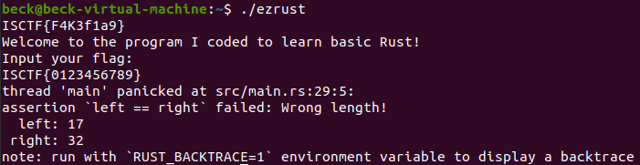

Rust编写的，保留符号并且0优化

套了一个UPX4.02的壳，无魔改，查壳时能直接发现，工具脱壳即可

可以尝试运行程序观察输入输出，如果执行此步了，能得到flag长度为32的信息，当然IDA里也能看

之后扔到IDA里看就行，刚放进去的时候IDA识别可能有些小问题，函数的未知参数比较多，像这样

进函数，让IDA识别一下参数，再出来F5刷新几次，把存在这种未知参数的刷掉就开始正常的逆向分析了

判断的地方也很好找，然后根据变量往上找赋值操作即可，因为带着符号，所以做了什么操作都容易看出来，如果稍微了解一点Rust或者其他编程语言，也能猜出来前面进行了一个循环，是取Vec[index]的操作

再往上追就追到输入和两个加密函数了，函数名字唬人起了个noname_encode

那实际上刚才的判断就已经清晰了，类似于num1[i] + input[i] != num2[i] - KEY[ORDER[i]]

此时进noname_encode函数去识别加密方式即可，实际上就是一个简单的异或操作

而数据呢来自上面比较难看的赋值，想办法提出来即可

如果调试的话，在noname_encode和main函数中check循环里，都有插入的有编写的，用时间差检测调试的函数来实现简单anti-debug

此时经过解密后得到的num1和num2数组的值，在IDA中显示的应该是0XFF和0x80，而这题的灵感来源与RustCourse中的整形溢出部分，在编程时num1和num2设置的值为:u8 = 255和:i8 = -128

> #### [整型溢出](https://course.rs/basic/base-type/numbers.html#整型溢出)
>
> 假设有一个 `u8` ，它可以存放从 0 到 255 的值。那么当你将其修改为范围之外的值，比如 256，则会发生**整型溢出**。关于这一行为 Rust 有一些有趣的规则：当在 debug 模式编译时，Rust 会检查整型溢出，若存在这些问题，则使程序在编译时 *panic*(崩溃,Rust 使用这个术语来表明程序因错误而退出)。
>
> 在当使用 `--release` 参数进行 release 模式构建时，Rust **不**检测溢出。相反，当检测到整型溢出时，Rust 会按照补码循环溢出（*two’s complement wrapping*）的规则处理。简而言之，大于该类型最大值的数值会被补码转换成该类型能够支持的对应数字的最小值。比如在 `u8` 的情况下，256 变成 0，257 变成 1，依此类推。程序不会 *panic*，但是该变量的值可能不是你期望的值。依赖这种默认行为的代码都应该被认为是错误的代码。

如果按照得到的数据进行运算，这个等式并不成立num1[i] + input[i] != num2[i] - KEY[ORDER[i]]

因此考虑到两边的整形溢出后，再将等式进行推算，即可得到flag的值

